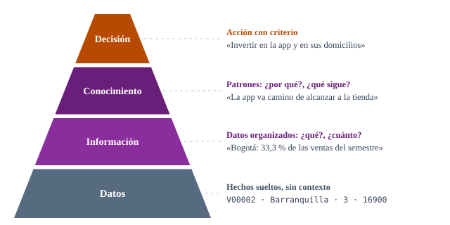
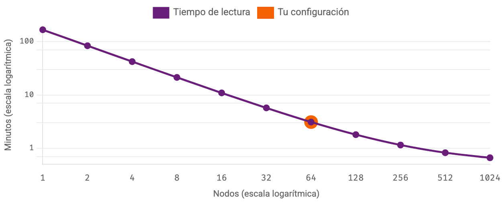
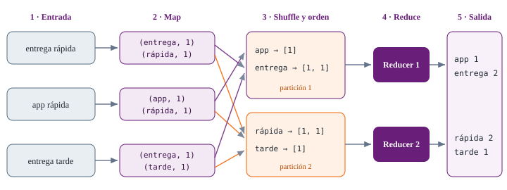
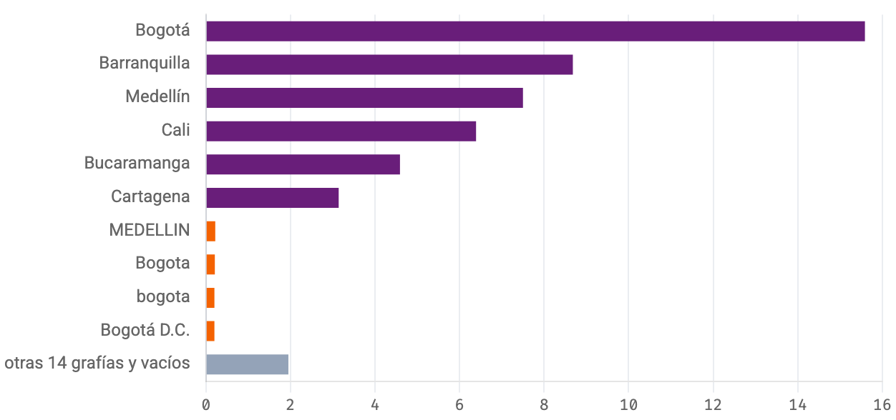
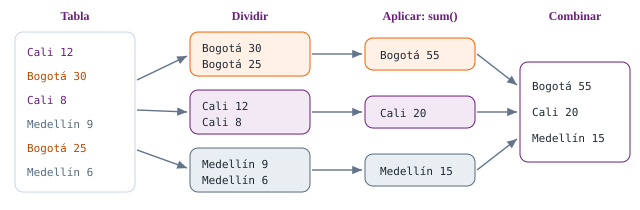

<!--
  Sesión 1 (6 h = 4 bloques de 75 min con breaks de 15, 30 y 15).
  Las diapositivas acompañan la exposición y el trabajo en Colab: en los
  bloques 3 y 4 cada diapositiva de código corresponde a una celda del
  notebook (mismo identificador entre corchetes en el material).
  Fuera de la presentación quedan los cuestionarios completos, los
  simuladores (se abren en vivo desde el enlace de cada divisor), el
  glosario y las lecturas.
-->

# Bienvenida {seccion=modulo-1}

> Una empresa no decide con datos: decide con información confiable que alguien obtuvo a partir de datos.

???
Abrir con la frase y con la pregunta: ¿qué pasa entre el registro que deja una caja registradora y el gráfico que mira la gerencia? Ese trabajo silencioso —recopilar, limpiar, transformar, verificar, guardar— es el curso.

## Hoy, la lógica en pequeño; luego, la escala y el texto a fondo

::: tarjetas
### Sesión 1 · hoy · 6 h
**Del dato al MapReduce.** Seis etapas, nube y Hadoop, limpieza con pandas y MapReduce en Python.
### Sesión 2 · 4 h
**De Hadoop a Spark.** HDFS y Hadoop Streaming en Colab, PySpark, Spark SQL y datos semiestructurados.
### Sesión 3 · 6 h
**Bases de datos y datos no estructurados.** Spark SQL, lenguaje natural, sentimientos y cierre del caso.
:::

???
El mapa completo está en el módulo 1 del material. Insistir en que el caso es el mismo en las tres sesiones: lo que hoy limpiamos con pandas, en la sesión 2 lo procesamos con Spark.

## Seis horas en cuatro bloques de 75 minutos

::: flujo
1. **Reconocimiento** — del dato a la decisión, el caso y las seis etapas
2. **Nube y Hadoop** — por qué un computador no alcanza, HDFS y MapReduce
3. **pandas** — cargar, limpiar con reglas y resumir
4. **MapReduce en Python** — conteo de palabras, Streaming y cierre
:::

Breaks de **15**, **30** y **15** minutos entre bloques. Desde el bloque 3 trabajamos en Colab.

???
Pedir que escriban la hora de inicio en la agenda del material: la agenda y la barra lateral se ajustan a la hora real. Los bloques 3 y 4 son de manos en el teclado: el entorno tiene que quedar listo al final del bloque 1.

## Tres criterios valoran el curso, y hoy tocamos los tres

| Criterio | Qué pide | Dónde aparece hoy |
|---|---|---|
| **CR1** | Seguridad en la transformación del dato | Un control por etapa; datos personales en la nube |
| **CR2** | Integrar lo cuantitativo y lo cualitativo | Ventas (números) y reseñas (texto) del mismo caso |
| **CR3** | Controles de calidad y coherencia | Reporte antes y después; verificación por dos caminos |

Evaluación formativa: **autoevaluación** (los cuestionarios), **coevaluación** y **heteroevaluación** del taller.

???
CR3 habla de bases de datos: hoy hacemos los controles todavía sin base de datos, en la sesión 2 los repetimos en Hadoop y Spark, y en la sesión 3 los llevamos a una base de datos con Spark SQL. La rúbrica del taller está en el módulo 17; los criterios se acuerdan con el grupo.

# Del dato a la decisión {seccion=modulo-2}

> `V00002, 2025-01-01, Barranquilla, Tienda, C0182, P011, 3, 16900`. ¿Qué hay que hacerle a esta fila para poder decidir con ella?

???
Dejar la fila en pantalla unos segundos. Son datos: concretos pero mudos.

## Cada escalón se construye procesando el anterior

{alto=420}

El procesamiento de datos es, sobre todo, el paso del primer escalón al segundo.

???
En la literatura es la pirámide DIKW, con la sabiduría (*wisdom*) en la cima; el material la cambia por la decisión, que es donde esa sabiduría se vuelve acción. Antes de seguir, lanzar el diagnóstico del módulo 2 (cinco preguntas, sin calificación) y pedir que compartan en el chat cuántas acertaron al primer intento.

## ¿Dato, información o conocimiento? {.pregunta}

1. El **3** de la columna `cantidad` en la venta `V00002`.
2. «En junio, el **35,9 %** de las ventas entró por la app».
3. «Cuando llueve, las ventas de la tienda física bajan y las de la app suben, porque los clientes prefieren el domicilio; así ocurrió en cada temporada de lluvias de los últimos tres años».

::: respuesta
**1, dato**: un registro suelto. **2, información**: responde *cuánto*, pero no *por qué*. **3, conocimiento**: explica la causa y permite anticipar la próxima temporada.
:::

???
Son las preguntas 1 a 3 del diagnóstico. Si ya lo hicieron, comentar dónde fallaron más. La pista que mejor funciona para la 2: ¿la frase explica por qué ocurre, o solo dice cuánto?

## Basura entra, basura sale {.idea}

Si en el paso de datos a información se cuela una venta duplicada o una ciudad mal escrita, el gráfico y la decisión heredan el error, y con más autoridad, porque ya «viene de los datos».

???
Por eso la mitad del curso trata de calidad. Dejar sembrada la pregunta que responderemos en el bloque 3: ¿qué le pasa a un promedio si una venta se cargó dos veces?

# El caso Guadua {seccion=modulo-3}

> Por primera vez, la gerencia consolidó las ventas del semestre en un solo archivo. Los totales por ciudad no cuadran.

???
Tiendas Guadua S.A.S. es ficticia, y sus datos también: decirlo explícitamente. Seis ciudades, tienda web y app con domicilios; cada canal con su propio sistema.

## Cinco preguntas de la gerencia guían toda la sesión

1. ¿Podemos **confiar** en el consolidado? ¿Qué está mal y cuánto pesa?
2. ¿Cuánto vendimos por **ciudad**, **canal** y **categoría**?
3. ¿Es cierto que la **app** está ganando terreno?
4. ¿Qué dicen los **clientes** cuando escriben una reseña?
5. Si mañana los datos fueran **mil veces más**, ¿el mismo proceso seguiría funcionando?

???
Volveremos a esta lista en el cierre, con una respuesta para cada pregunta. La quinta es la que abre el bloque 2.

## Estructura, no formato: así se distinguen los tipos de dato

::: tarjetas
### Estructurado
`ventas.csv`: 3.029 filas × 10 columnas. Todas las filas cumplen el mismo esquema.
### Semiestructurado
`logs_web.jsonl`: cada evento nombra sus campos, pero no todos tienen los mismos y algunos van anidados.
### No estructurado
`resenas.csv`: 40 reseñas en lenguaje natural. Para sacar algo de ahí hay que procesar el texto.
:::

Las 3.029 filas caben en cualquier portátil, y está bien: lo que hoy hacemos con pandas es lo que Hadoop y Spark reparten entre muchas máquinas.

???
Las muestras de cada archivo y el diccionario de datos de `ventas.csv` están en el módulo 3. Los logs los trabajaremos en la sesión 2; las reseñas, hoy (conteo de palabras) y en la sesión 3 (sentimientos).

## ¿Cuáles son datos no estructurados? {.pregunta}

1. Las reseñas escritas por los clientes.
2. Las grabaciones de llamadas al servicio al cliente.
3. Las fotos de las facturas de los proveedores.
4. El archivo `ventas.csv`.
5. El archivo `logs_web.jsonl`.

::: respuesta
**1, 2 y 3**: texto libre, audio e imágenes no traen campos que leer. `ventas.csv` es estructurado y `logs_web.jsonl`, semiestructurado.
:::

???
Pregunta 4 del diagnóstico. La pista: no estructurado significa que no hay campos que leer; hay que procesar el contenido (transcribir el audio, reconocer el texto de la foto) para extraer algo.

# Seis etapas del procesamiento {seccion=modulo-4}

> Desde una hoja de cálculo hasta un clúster de mil máquinas: cambian las herramientas, no la lógica.

## Todo procesamiento de datos recorre seis etapas, y es un ciclo

::: tarjetas {columnas=3}
### 1 · Recopilación
Capturar de las fuentes
### 2 · Preparación
Limpiar y validar
### 3 · Introducción
Cargar al sistema
### 4 · Procesamiento
Transformar y analizar
### 5 · Interpretación
Comunicar resultados
### 6 · Almacenamiento
Guardar y gobernar
:::

Lo almacenado es la entrada del siguiente ciclo de recopilación.

???
El componente de ciclo del módulo 4 tiene, para cada etapa, qué ocurre, el caso, el riesgo de calidad, el control de seguridad, las herramientas y qué nos devuelve a una etapa anterior: recorrerlo en vivo si hay tiempo. La preparación es la etapa que más tiempo consume en un proyecto real.

## Cada etapa tiene su riesgo y su control de seguridad

| Etapa | Riesgo de calidad | Un control de seguridad |
|---|---|---|
| Recopilación | Fuentes con formatos distintos; registros enviados dos veces | Minimización; autorización del titular |
| Preparación | Borrar registros válidos o «corregir» inventando un valor | Reglas documentadas; cuarentena |
| Introducción | Tipos mal inferidos; tildes rotas por la codificación | Control de acceso; cifrado en tránsito |
| Procesamiento | Doble conteo en una unión; promedio de promedios | Verificar por dos caminos; seudónimos |
| Interpretación | Confundir correlación con causa | Publicar solo agregados |
| Almacenamiento | Versiones contradictorias; pérdida sin respaldo | Respaldo, cifrado y retención |

???
La actividad del caso en cada etapa la encuentran ellos en el ejercicio en parejas (módulo 5): no adelantarla. El componente de ciclo del módulo 4 trae, además, qué nos devuelve a una etapa anterior: recorrerlo en vivo si hay tiempo.

## ETL transforma antes de cargar; ELT carga y luego transforma

| | ETL | ELT |
|---|---|---|
| **Orden** | Extraer → transformar → cargar | Extraer → cargar → transformar |
| **Qué se guarda** | Solo el dato limpio | El crudo y sus versiones transformadas |
| **Cuándo conviene** | Volúmenes moderados, esquemas estables | Grandes volúmenes y fuentes variadas |
| **Datos personales** | Se pueden seudonimizar antes de llegar | El crudo los conserva: exige más control de acceso y cifrado |

???
En ELT se transforma dentro de la plataforma de destino: un lago de datos procesado con Spark o una bodega de datos en la nube. Ojo con el orden en la práctica: para limpiar con pandas, primero hay que leer el archivo, así que preparación e introducción se entrelazan.

## La calidad del dato también es una obligación legal {columnas=3:2}

**Ley Estatutaria 1581 de 2012** (*habeas data*). De sus ocho principios, los que más pesan al procesar datos son:

- **Finalidad** y **libertad**: solo para el fin informado, con consentimiento previo
- **Veracidad o calidad**: veraz, completa, exacta y actualizada
- **Acceso y circulación restringida**, **seguridad** y **confidencialidad**

|||

::: warn Seudónimo no es anónimo
En el caso, el cliente es `C0182` y no su nombre. Pero sigue siendo **dato personal** mientras exista la tabla que liga `C0182` con la persona: esa tabla se guarda aparte y con acceso restringido.
:::

???
Los otros dos principios son legalidad y transparencia. La reglamentación está compilada en el Decreto 1074 de 2015. Seudonimizar desde la recopilación protege todas las etapas siguientes, no solo la publicación.

# El caso por etapas y Colab {seccion=modulo-5}

> Del ciclo al caso: cada actividad de Guadua tiene su etapa y su control. Y el entorno queda listo para el bloque 3.

???
Dos tareas antes del break: el ejercicio en parejas y dejar Colab funcionando.

## Cada actividad, a su etapa {.pregunta etiqueta="Ejercicio en parejas · 5 min"}

En parejas: cada actividad a su etapa, con un control de seguridad.

1. Se calcula el total vendido por ciudad y canal.
2. Cada tienda exporta las ventas del semestre desde su caja.
3. La tabla limpia y el reporte se guardan con respaldo.
4. «Bogotá D.C.», «bogota» y « Bogotá» resultan ser la misma ciudad.
5. Se presenta a la junta la participación de la app por mes.
6. Se lee el consolidado indicando que el precio es un número.

::: respuesta
**2** recopilación · **4** preparación · **6** introducción · **1** procesamiento · **5** interpretación · **3** almacenamiento.
:::

???
Para el chat: los números en el orden de las etapas (2 · 4 · 6 · 1 · 5 · 3). Pista: hay exactamente una actividad por etapa; para separar preparación de introducción, preguntarse si la acción cambia el contenido del dato o solo lo pone en el sistema con el tipo correcto. Controles posibles (solución del módulo 5): exportar solo las columnas necesarias; documentar la regla y contar las filas que cambió; validar el esquema al cargar; verificar el total por un segundo camino; mostrar solo agregados y declarar la calidad de la cifra; respaldo, cifrado y retención. En el material las actividades llevan letras a–f, en este mismo orden.

## Deja listo Colab antes del bloque 3

::: flujo
1. **Abrir en Colab** — el botón del módulo 5 abre el notebook de la sesión
2. **Guardar una copia en Drive** — el enlace no conserva cambios; tu copia sí
3. **Ejecutar la primera celda** — «Crea los datos del caso» genera los cuatro archivos
4. **Comparar** — las dos celdas siguientes con las salidas del material
:::

::: warn Cada sesión de Colab es temporal
Si tras un break ya no están los archivos: **Entorno de ejecución → Ejecutar anteriores**. Los datos salen idénticos.
:::

???
Si Colab advierte que el notebook no lo creó Google, elegir «Ejecutar de todos modos». Si el enlace no se abre: descargar el notebook y subirlo (Archivo → Subir cuaderno). Quien no alcance lo termina en el break.

## Break de 15 minutos {.idea etiqueta="Break" icono=fa-mug-hot}

Al volver: ¿por qué un solo computador no alcanza, y qué hacen la nube y Hadoop al respecto?

???
Quien no dejó listo Colab lo hace ahora.

# Un computador no alcanza {seccion=modulo-6}

> La quinta pregunta de la gerencia: si mañana los datos fueran mil veces más, ¿el mismo proceso seguiría funcionando?

## Big Data es el punto en que los datos dejan de caber en la herramienta

- **Volumen** — cuántos datos hay: millones de líneas de venta al día en una cadena real
- **Velocidad** — a qué ritmo llegan y qué tan rápido hay que responder
- **Variedad** — la tabla de ventas, el JSON de la web, el texto de las reseñas
- **Veracidad** — cuánto se puede confiar: ya vimos 29 ventas repetidas
- **Valor** — sin una decisión al final, el resto de las V es solo costo

???
«Big Data» no es un número de filas: es el punto en que los datos dejan de caber en la memoria, en el disco o en el tiempo disponible de la herramienta con la que se venían procesando.

## Crecer hacia arriba tiene techo; crecer hacia los lados exige coordinar

| | Escalado vertical (*scale up*) | Escalado horizontal (*scale out*) |
|---|---|---|
| **Idea** | Una máquina más grande | Más máquinas comunes: un **clúster** |
| **Límite** | La máquina más grande que se pueda comprar | Mucho más alto, con costo de coordinación |
| **Si falla** | Todo se detiene | Los demás nodos siguen, si hay réplicas |
| **Lo difícil** | Nada nuevo que programar | Repartir y coordinar: Hadoop y Spark |

???
El costo del escalado vertical crece más rápido que la capacidad; el del horizontal, casi en proporción. La fila «Si falla» se retoma con HDFS en el módulo 8.

## El clúster compensa solo si \(T(n) < T(1)\)

$$T(1) = \frac{D}{v} \qquad\qquad T(n) = \frac{D}{n \cdot v} + c \quad \text{si } n > 1$$

- \(T(n)\): el tiempo de leer los datos con \(n\) discos; \(D\): su tamaño (MB); \(v\): lo que entrega un disco (MB/s)
- \(n\) discos que leen **a la vez** dividen el tiempo entre \(n\)…
- …pero coordinarlos cuesta un tiempo fijo \(c\) (en segundos) que una sola máquina no paga

???
Es pura aritmética. Preguntar antes de la gráfica (dos diapositivas más adelante): ¿qué pasa con \(T(n)\) cuando \(n\) crece muchísimo? \(D/(n \cdot v)\) tiende a cero y \(T(n)\) se acerca a \(c\) sin bajar de ahí. Con 1 GB a 100 MB/s (10 s con un disco) y \(c\) = 30 s, el clúster no compensa nunca.

## Un disco tarda casi tres horas en leer 1 TB. ¿Y cien discos? {.pregunta}

Un disco entrega unos **100 MB/s**. Si repartimos el terabyte entre cien discos que leen a la vez, sin contar la coordinación, ¿cuánto tardan?

::: respuesta
**Menos de dos minutos.** 1.000.000 MB / 100 MB/s son 10.000 s con un disco; con cien, cada uno lee 10.000 MB: 100 s. White (2015) abre su libro sobre Hadoop con este ejemplo: leer en paralelo es la idea de fondo.
:::

???
La idea central del ecosistema sale de aquí: como mover terabytes por la red también toma tiempo, se lleva el cómputo a donde están los datos, y no al revés. La pregunta 3 del cierre parte de este cálculo y le suma la coordinación: no adelantarla.

## Más nodos no siempre compensan: el tiempo nunca baja de \(c\)

{alto=400}

De 512 a 1.024 nodos el tiempo solo baja de 50 a 40 s: nunca baja de \(c\) = 30 s. Y con datos pequeños, \(c\) domina y el clúster es **más lento** que un portátil.

???
El punto naranja es el que el simulador llama «Tu configuración»; con un solo nodo, la lectura toma 2 h 47 min. Abrir el simulador del módulo 6 en vivo: con los 30 s iniciales de coordinación basta bajar los datos a 1 GB para que el clúster pierda (un nodo tarda 10 s; 64 nodos, 30 s: tres veces más lento). En la realidad es peor, porque \(c\) crece con \(n\). Las 3.029 ventas del caso se procesan en milisegundos con pandas: montar Hadoop para ellas sería como contratar un camión de mudanzas para llevar una carta.

# La nube {seccion=modulo-7}

> Levantar un clúster de cien nodos para un trabajo de una hora, y pagar solo esa hora.

## La nube alquila recursos por uso, y cinco características la definen {columnas=1:1}

::: definicion Definición (NIST SP 800-145)
Acceso por red, ubicuo, conveniente y bajo demanda, a un conjunto compartido de recursos de cómputo configurables que se aprovisionan y liberan con rapidez, con un mínimo esfuerzo de gestión (Mell y Grance, 2011).
:::

|||

- **Autoservicio** bajo demanda
- **Amplio acceso** por red
- **Recursos compartidos**
- **Elasticidad** rápida
- **Servicio medido**

???
Un ejemplo por característica: pedir el clúster desde una consola sin hablar con nadie; usar Colab desde el navegador; el proveedor atiende a muchos clientes con la misma infraestructura; diez nodos para el cierre de mes y dos el resto del tiempo; se cobra por hora de máquina, gigabyte guardado o consulta.

## IaaS, PaaS y SaaS se distinguen por quién administra cada capa

| Modelo | Capas que administra Guadua (de 9) | Cómo procesaría sus datos |
|---|---|---|
| En casa | 9: todas | Compra servidores e instala Linux, Java, Hadoop y Spark |
| **IaaS** | 5: de los datos al sistema operativo | Alquila máquinas virtuales e instala Hadoop y Spark |
| **PaaS** | 2: datos y aplicación | Usa un clúster que el proveedor instala, escala y repara |
| **SaaS** | 1: sus datos | Una herramienta de BI terminada, como Looker Studio |

???
Abrir el simulador «La pila de responsabilidad» del módulo 7 y cambiar de modelo: se ve moverse la frontera. Colab queda en la frontera entre SaaS y PaaS: como producto es un notebook listo, pero el código lo escribimos nosotros. El patrón más común para Big Data es el clúster gestionado y efímero: se crea, hace su trabajo y se apaga. Ejemplos de PaaS: EMR, Dataproc, HDInsight, Databricks (no proyectarlos todavía: los nombra la pregunta siguiente).

## Usar Spark sin instalarlo y pagar solo por hora: ¿qué modelo es? {.pregunta}

Guadua quiere procesar sus ventas con Spark sin instalar ni mantener servidores, y pagando solo las horas de uso. Un clúster gestionado como **Amazon EMR** o **Google Cloud Dataproc** es…

- a) PaaS
- b) *On-premise*
- c) IaaS
- d) SaaS

::: respuesta
**a) PaaS.** El proveedor entrega Hadoop y Spark instalados y mantenidos; Guadua aporta datos y código. En IaaS tendría que instalarlos y repararlos ella misma; un SaaS sería una aplicación terminada, sin código propio.
:::

???
Pregunta 1 del control del bloque 2, que está al final del módulo 9: que respondan solo esa antes de revelar. Pista: ¿instala Spark o solo lo usa?

## Los datos siguen siendo tuyos… y tu responsabilidad

En todos los modelos, la capa de **datos** es del cliente.

- El proveedor que guarda o procesa datos personales **fuera de Colombia** por cuenta de tu empresa es su *encargado*: eso es una **transmisión** internacional, que exige un contrato (Decreto 1074 de 2015)
- Si el proveedor los usara **para sus propios fines**, sería una **transferencia**: la Ley 1581 (art. 26) solo la permite hacia países con nivel adecuado de protección, salvo excepciones

Elegir la región del centro de datos y revisar el contrato también son decisiones legales.

???
El artículo de la transmisión es el 2.2.2.25.5.2 del Decreto 1074. Los modelos de despliegue (pública, privada, comunitaria, híbrida) están en la tabla del módulo 7; la híbrida es la típica para datos sensibles en casa y picos de cómputo en la nube.

# Ecosistema Hadoop {seccion=modulo-8}

> Dos ideas: repartir los datos entre muchas máquinas y llevar el cómputo hasta los datos.

## Hadoop guarda con HDFS, reparte con YARN y procesa con MapReduce

::: tarjetas
### HDFS
Guarda los archivos partidos en **bloques** replicados entre los nodos.
### YARN
Reparte CPU y memoria entre los trabajos, y procura lanzar cada tarea donde está su bloque.
### MapReduce
El modelo de programación para procesar en paralelo los datos de HDFS.
:::

Hadoop nació a mediados de los años 2000, a partir de dos artículos de Google: el sistema de archivos GFS (2003) y MapReduce (2004).

???
Alrededor del núcleo creció un ecosistema (Hive, Spark, Kafka…): el simulador «Piezas del ecosistema» del módulo 8 dice qué hace cada una y dónde aparecería en el caso. YARN: el ResourceManager conoce los recursos libres; un NodeManager en cada nodo lanza los contenedores.

## HDFS parte cada archivo en bloques y guarda cada bloque varias veces

$$\text{bloques} = \left\lceil \frac{\text{tamaño del archivo}}{\text{tamaño de bloque}} \right\rceil$$

$$\text{espacio usado} = \text{tamaño del archivo} \times \text{réplicas}$$

- Bloques de **128 MB** y **3 réplicas** por defecto
- El **NameNode** lleva el índice: qué bloques forman cada archivo y dónde está cada copia
- Los **DataNodes** guardan los bloques

???
Abrir el simulador «Un archivo en HDFS» y apagar nodos: con replicación 1 basta una caída para perder el archivo; con 3, ni dos caídas lo rompen. El simulador pone las copias en nodos consecutivos para que se vea el patrón; HDFS real las reparte entre nodos y racks distintos.

## 1.000 MB en bloques de 128 MB, replicación 3: ¿cuántas réplicas? {.pregunta}

Contando todas las copias de cada bloque.

::: respuesta
**24 réplicas.** \(\lceil 1.000 / 128 \rceil = 8\) bloques, porque el sobrante también necesita su bloque, y cada uno con 3 copias: \(8 \times 3 = 24\).
:::

???
Pregunta 2 del control del bloque 2 (final del módulo 9): que la respondan allí antes de revelar. Errores típicos, los que comenta el material: 21, por redondear a 7 bloques; 16, por contar solo dos copias «además del original» (el factor 3 ya las incluye todas); 8, por olvidar la replicación. El espacio usado es 3 × 1.000 = 3.000 MB, no 24 × 128 = 3.072 MB: el octavo bloque guarda solo los 104 MB que sobran (1.000 − 7 × 128).

## HDFS asume que las máquinas fallan, y replica {.idea icono=fa-clone}

En un clúster de mil máquinas comunes, que alguna falle es la rutina de cada semana. Cuando un DataNode deja de reportarse, el NameNode copia sus bloques desde las réplicas. El precio: con replicación 3, guardar 1 TB ocupa 3 TB.

???
La excepción es el propio NameNode: si cae, nadie sabe dónde está cada bloque. Por eso en producción se configura un segundo NameNode en espera (alta disponibilidad).

# MapReduce {seccion=modulo-9}

> Quien programa escribe solo dos funciones; el sistema se encarga de todo lo difícil.

## `map` emite pares clave–valor; `reduce` resume los valores de cada clave

$$\text{map}\colon (k_1, v_1) \rightarrow \text{lista}(k_2, v_2) \qquad \text{reduce}\colon \big(k_2, \text{lista}(v_2)\big) \rightarrow \text{lista}(v_2)$$

- `map` toma un registro y emite pares *clave–valor*
- El sistema **agrupa** todos los valores que comparten clave
- `reduce` recibe una clave con su lista de valores y la resume

???
La propuesta de Dean y Ghemawat (2004). En el conteo de palabras, \((k_1, v_1)\) = (posición, línea de texto); \((k_2, v_2)\) = (palabra, 1); reduce devuelve el total de cada palabra. Lo programaremos nosotros mismos en el bloque 4.

## Cada reducer recibe todas las apariciones de sus claves

{alto=400}

Cada mapper ve solo su bloque; la partición decide a qué reducer va cada clave: `hash(clave) mod R`.

???
En el dibujo, lo morado va al reducer 1, y lo naranja, al 2. Las seis fases completas están en el módulo 9; la que falta aquí es el *combine*, un «mini reduce» opcional dentro de cada mapper para que viajen menos pares por la red. No decir todavía en qué fase viajan los pares: es la pregunta siguiente.

## ¿En qué fase viajan por la red los pares que emiten los mappers? {.pregunta}

- a) En el map
- b) En el *shuffle*
- c) En la lectura de la entrada
- d) En el reduce

::: respuesta
**b) En el *shuffle*.** Los pares salen del nodo que los produjo y viajan al reducer de su partición. Cada tarea map, en cambio, lee en lo posible el bloque de su propio nodo: es la localidad de datos.
:::

???
Pregunta 3 del control del bloque 2 (final del módulo 9): que la respondan allí antes de revelar. Por eso el *combiner*, que aligera lo que viaja, ahorra tanto.

## Un sistema de Big Data es una tubería de tres tramos

::: flujo
1. **Ingesta: que el dato entre** — por lotes, como copiar cada noche los datos de las cajas al clúster; o en flujo continuo, como los eventos de la app con Kafka
2. **Procesamiento: que se transforme** — limpieza, uniones y agregaciones con MapReduce, Spark o Hive
3. **Explotación: que se use** — SQL con Hive o Impala, tableros de BI, modelos
:::

No confundas el *streaming* (datos que llegan sin parar) con **Hadoop Streaming** (módulo 16), que es procesamiento por lotes.

???
Sqoop, la herramienta clásica de ingesta por lotes, se retiró en 2021: hoy se usa Spark o los servicios de la nube.

## Break de 30 minutos {.idea etiqueta="Break" icono=fa-mug-hot}

Al volver, del clúster al portátil: las 3.029 ventas caben en Colab, y con pandas responderemos la primera pregunta de la gerencia: ¿podemos confiar en el consolidado?

???
Lo más probable es que Colab haya reiniciado la sesión durante el break: pedir que vayan a la celda en la que iban y usen **Entorno de ejecución → Ejecutar anteriores**.

# Python y pandas {seccion=modulo-10}

> No hace falta ser programador para procesar datos con Python, pero sí leer con calma unas pocas piezas.

???
Puente desde el bloque 2: para 3.029 filas, montar Hadoop sería el camión de mudanzas para llevar una carta; la lógica se aprende en el portátil, y en la sesión 2 la repartimos con Spark. El material reparte el bloque en 10 · 15 · 30 · 20 min (módulos 10 a 13), y al volver del break largo hay que reanudar Colab. Si se va tarde: el ejercicio de clientes distintos (módulo 11) se resuelve en pantalla y los dos ejercicios del módulo 13 (día de la semana, categoría por la app) quedan para casa.

## Un DataFrame es una tabla; una máscara de `True`/`False` la filtra {columnas=3:2}

```python [py_pandas] {resaltar=5-13}
import pandas as pd
ciudades = ["Bogotá", "Medellín", "Cali"]
montos = [120_000, 85_500, 64_200]

mini = pd.DataFrame({"ciudad": ciudades, "monto": montos})
print("Promedio:", mini["monto"].mean())

# La condición da True/False por fila: se quedan las True
print(mini[mini["monto"] > 80_000])
#> Promedio: 89900.0
#>      ciudad   monto
#> 0    Bogotá  120000
#> 1  Medellín   85500
```

|||

- **Series**: una columna con su índice
- **DataFrame**: columnas con nombre, todas del mismo largo
- Para combinar condiciones: `&` «y», `|` «o», `~` «no»

???
Recortado: las dos listas vienen de `[py_basico]`, y el bloque del material también imprime la tabla completa (con Cali, 64.200, que el filtro deja fuera). Para quien nunca programó, el módulo 10 trae la tabla de las cinco piezas (lista, diccionario, función, lambda, comprensión) y cinco reglas para leer cualquier bloque: `=` es asignación, los paréntesis ejecutan, el punto pide algo a un objeto, la sangría es parte del código y `#` es un comentario.

# Cargar e inspeccionar {seccion=modulo-11}

> Cinco instrucciones de pandas bastan para que el consolidado muestre sus problemas, antes de cambiar un solo valor.

???
Del repaso de Python al consolidado real: ejecutar las cinco instrucciones, en orden, en el notebook.

## Antes de limpiar, mirar: cinco instrucciones levantan el inventario

| Instrucción | Qué revela en `ventas.csv` |
|---|---|
| `ventas = pd.read_csv(…)` y `.shape` | 3.029 filas y 10 columnas |
| `.info()` | `precio_unitario` leído como texto (`object`) |
| `.describe()` | `cantidad` va de **−3** a **580** |
| `["ciudad"].value_counts()` | **24** grafías para 6 ciudades |
| `.isna().sum()` | Vacíos: 557 en cliente, 72 en descuento, 11 en ciudad y 29 en pago |

???
Ejecutarlas en orden en el notebook (módulo 11). Sobre `info()`: basta un solo valor que no se pueda leer como número para que pandas lea toda la columna como texto. Nadie compra −3 unidades, y 580 de un producto en una tienda de barrio huele a error de digitación. Ejercicio rápido del módulo 11: 1.016 clientes distintos y el 18,4 % de las ventas sin cliente (con `nunique()` e `isna().mean()`).

## Seis ciudades, 24 grafías {.pregunta columnas=1:1}

```python [conteos]
ventas["ciudad"].value_counts()
#> Bogotá                 969
#> Medellín               547
#> Cali                   413
#> Barranquilla           360
#> …
#> barranquilla            14
#> …
#> Barranquilla             8
#> B/quilla                 7
#> Cali                     7
#> …
```

|||

«Barranquilla» y «Cali» aparecen **dos veces**, escritas igual. ¿Cómo puede ser?

::: respuesta
A una de las dos le sobra un **espacio al final** (`"Barranquilla "`, `"Cali "`): para Python son textos distintos, aunque en pantalla se vean iguales. Por eso la limpieza de ciudades empieza por `strip()`.
:::

???
Pista si nadie lo ve: ¿qué caracteres no se ven en pantalla? Salida recortada: la lista completa tiene 24 líneas y está en el módulo 11. Otras grafías para comentar: «B/manga», «Cartagena de Indias», « Bogotá» con espacio al principio.

# Limpiar con reglas {seccion=modulo-12}

> Limpiar no es «arreglar lo que se vea raro»: es aplicar reglas explícitas, cada una justificada, documentada y medible.

## Cada regla de limpieza responde a una dimensión de calidad

| Dimensión | Pregunta que responde | En el caso Guadua |
|---|---|---|
| **Unicidad** | ¿Cada hecho está una sola vez? | 29 filas repetidas |
| **Consistencia** | ¿Lo mismo se escribe igual? | 24 grafías para 6 ciudades; 9 para 3 canales |
| **Validez** | ¿Cumple el tipo y el formato? | 74 precios como texto; 107 fechas dd/mm/aaaa |
| **Exactitud** | ¿Corresponde a la realidad? | 31 cantidades imposibles, de −3 a 580 |
| **Completitud** | ¿Están todos los datos? | Vacíos: 557 en cliente, 72 en descuento, 11 en ciudad, 29 en pago |
| **Oportunidad** | ¿Llega a tiempo para decidir? | El consolidado de enero a junio llega en agosto |

???
Es el inventario de problemas del módulo 11, ordenado por dimensión. Algunas cifras —filas repetidas, grafías del canal, precios con «$» y fechas dd/mm/aaaa— no salen de las cinco instrucciones: las mide el módulo 12, paso a paso. Son las seis dimensiones primarias de DAMA UK (2013); la ISO/IEC 25012 usa quince características. Una cantidad de −3 puede llamarse problema de validez (regla de negocio) o de exactitud (¿pudo ocurrir así?): cualquiera de las dos etiquetas es defendible si se declara en la bitácora.

## Primero los duplicados, para no limpiar dos veces la misma venta {.codigo-grande}

```python [duplicados]
df = ventas.copy()            # el original no se toca
print("Filas iniciales:", len(df))
print("Filas duplicadas:", df.duplicated().sum())
df = df.drop_duplicates()
print("Filas tras quitar duplicados:", len(df))
#> Filas iniciales: 3029
#> Filas duplicadas: 29
#> Filas tras quitar duplicados: 3000
```

Se limpia una **copia**, `df`, para comparar al final con el original `ventas`.

???
`duplicated()` marca cada fila idéntica a otra anterior en todas las columnas, incluido el `id_venta`; `drop_duplicates()` conserva la primera aparición. Las 29 filas repetidas eran una doble carga de la exportación.

## Cada grafía a su forma canónica, sin perder ninguna en silencio

```python [texto] {resaltar=10-12,14}
def normalizar(serie):
    """Minúsculas, sin espacios sobrantes y sin tildes."""
    return (serie.str.strip()
                 .str.lower()
                 .str.normalize("NFKD")
                 .str.encode("ascii", errors="ignore")
                 .str.decode("ascii"))

ciudad_norm = normalizar(df["ciudad"])
sin_regla = ciudad_norm[ciudad_norm.notna()
                        & ~ciudad_norm.isin(CIUDAD_CANONICA)]
print("Grafías sin regla:", sin_regla.unique())   # debe salir vacío
df["ciudad"] = ciudad_norm.map(CIUDAD_CANONICA).fillna("Sin dato")
#> Grafías sin regla: []
```

`CIUDAD_CANONICA` es un diccionario que lleva cada grafía normalizada a su ciudad: `"bogota d.c."` → «Bogotá», `"b/quilla"` → «Barranquilla»…

???
Recortado: faltan el diccionario `CIUDAD_CANONICA`, la línea que limpia el canal y los dos `print` con los conteos finales (`{'Bogotá': 1033, …, 'Sin dato': 11}` y `{'Tienda': 1349, 'App': 938, 'Web': 713}`); están en el módulo 12. Lo importante es el control resaltado: si mañana llega «Barranqui», sale en pantalla; sin él, `map` la convertiría en un vacío y `fillna` la escondería como «Sin dato». El truco de las tildes: NFKD separa la letra de su tilde y el paso a ASCII la descarta.

## Precios que sean números: 74 venían como `$3.100`

```python [precios]
precio_txt = df["precio_unitario"].astype(str)
df["precio_unitario"] = pd.to_numeric(
    precio_txt.str.replace(r"[$.\s]", "", regex=True), errors="coerce")
print("Precios sin convertir:", df["precio_unitario"].isna().sum())
#> Precios sin convertir: 0
```

::: warn Cuidado con el punto
Quitar los puntos funciona porque los precios en pesos son enteros. Con decimales (`12.5` dólares), el mismo código daría `125`, sin ningún aviso.
:::

???
Recortado: faltan las líneas que cuentan los precios con «$» (74, el dato del título) y muestran tres (`['$3.100', '$4.900', '$1.800']`), y la que imprime el tipo final (`int64`); están en el módulo 12. `[$.\s]` se lee «cualquiera de estos caracteres: signo de pesos, punto o espacio». `errors="coerce"` deja vacío lo que no pueda convertir, y el conteo lo delata. Toda regla de limpieza depende de conocer el negocio.

## Cada formato de fecha se interpreta de forma explícita {.codigo-grande}

```python [fechas]
iso = pd.to_datetime(df["fecha"], format="%Y-%m-%d", errors="coerce")
dma = pd.to_datetime(df["fecha"], format="%d/%m/%Y", errors="coerce")
print("Fechas en formato dd/mm/aaaa:", (iso.isna() & dma.notna()).sum())
df["fecha"] = iso.fillna(dma)
print("Fechas sin interpretar:", df["fecha"].isna().sum())
#> Fechas en formato dd/mm/aaaa: 105
#> Fechas sin interpretar: 0
```

Lo que no cumple ningún formato declarado queda vacío y **se cuenta**.

???
Recortado: falta la línea que imprime el rango (`Rango: 2025-01-01 a 2025-06-30`). 105 y no 107 como en el inventario: aquí ya se quitaron los duplicados, y dos de ellos traían la fecha dd/mm/aaaa. `format="mixed"` con `dayfirst=True` da el mismo resultado, pero decide fila por fila y puede leer `12/31/2025` como mes/día sin avisar. Ninguna de las dos formas resuelve `03/04/2025`: eso lo decide quien conoce la fuente.

## Lo imposible va a cuarentena: limpiar no es decidir por el negocio

```python [reglas] {resaltar=4,7-8}
fuera_de_rango = ~df["cantidad"].between(1, 50)
print(df.loc[fuera_de_rango, "cantidad"].value_counts()
        .sort_index().to_dict())
cuarentena = df[fuera_de_rango].copy()  # se apartan, no se borran
df = df[~fuera_de_rango].copy()
print("Filas válidas:", len(df), "· en cuarentena:", len(cuarentena))
#> {-3: 6, -2: 7, -1: 8, 0: 7, 120: 1, 330: 1, 580: 1}
#> Filas válidas: 2969 · en cuarentena: 31
```

¿Al 580 le sobra un cero? ¿Las negativas son devoluciones mal registradas? Lo decide alguien del negocio.

???
Recortado: falta la línea que imprime cuántas cantidades quedan fuera de [1, 50] (31). La regla de negocio dice que una línea de venta tiene entre 1 y 50 unidades.

## Los 557 vacíos de `id_cliente`, ¿son un error de calidad? {.pregunta .codigo-grande}

Averígüenlo en el notebook: cuenten los vacíos por canal en el original `ventas` (el canal también viene con varias grafías).

::: revelar
```python [sol_nulos_canal]
canal_limpio = ventas["canal"].str.strip().str.capitalize()
ventas["id_cliente"].isna().groupby(canal_limpio).sum()
#> canal
#> App         0
#> Tienda    557
#> Web         0
```
:::

::: respuesta
**No: el vacío significa algo.** Todos están en la tienda física, donde se puede comprar sin registrarse. Se rellenan con `ANONIMO`; borrarlos quitaría el 18,4 % de las ventas.
:::

???
Es el ejercicio del final del módulo 12: pedir que lo intenten en el notebook antes de revelar el código y la respuesta. Salida sin el pie `Name: id_cliente, dtype: int64`. Al revelar, ejecutar `[completitud]` (paso 6): el descuento sin registro se toma como 0, el cliente vacío como `ANONIMO` y el medio de pago desconocido queda como «Sin dato». Sin esa celda, el reporte siguiente no deja las celdas vacías en cero. Antes de tratar un vacío, preguntar por qué falta.

## El reporte de calidad: los indicadores de problema quedan en cero {columnas=3:2}

| Indicador | Antes | Después |
|---|---|---|
| filas | 3.029 | 2.969 |
| filas duplicadas | 29 | 0 |
| celdas vacías | 669 | 0 |
| grafías de ciudad | 24 | 7 |
| grafías de canal | 9 | 3 |
| precios no numéricos | 74 | 0 |
| fechas sin interpretar | 107 | 0 |
| cantidades fuera de rango | 31 | 0 |

|||

Conservamos **2.969** de 3.029 filas: el **98,0 %**.

Este cuadro responde la primera pregunta de la gerencia y es un control de coherencia del criterio **CR3**.

???
Siete valores de ciudad y no seis: las seis ciudades más «Sin dato», la etiqueta de las 11 ventas sin ciudad. La función `reporte_calidad` calcula los mismos indicadores sobre el original y sobre la tabla limpia (módulo 12). Las 107 «fechas sin interpretar» de antes son las dd/mm/aaaa del original: `reporte_calidad` solo lee aaaa-mm-dd, y cuenta también las 2 que venían en filas duplicadas (por eso el paso de fechas da 105).

## Sin limpiar, Barranquilla sale segunda. ¿Qué la infla? {.pregunta}

{alto=330}

Las ventas duplicadas · las grafías de la ciudad · una cantidad imposible · los precios guardados como texto

::: respuesta
**Una cantidad imposible.** Una sola venta por la app, de 580 unidades a 6.400 pesos, suma 3,5 millones. Apartada en cuarentena, Barranquilla baja a 5,2 millones y queda cuarta; con toda la limpieza suma 5,9, porque se le unen sus otras grafías.
:::

???
Abrir el tablero del módulo 12 con todo apagado y encender un paso a la vez: quitar duplicados la deja en 8,6; unificar grafías la sube a 9,0; convertir precios, a 9,0; apartar cantidades imposibles la baja a 5,2. La venta es la `V02508`. Es el «los totales por ciudad no cuadran» del divisor del caso: ahora sabemos por qué. No preguntar aquí por qué el gráfico engaña en general: es la pregunta 8 del cierre, que se responde en casa.

# Transformar y resumir {seccion=modulo-13}

> Con la tabla limpia, el procesamiento son tres movimientos: derivar, unir y resumir.

## Derivar y unir: `validate` impide multiplicar las ventas

```python [derivadas] y [union] {resaltar=6-8}
df["total"] = (df["cantidad"] * df["precio_unitario"]
               * (1 - df["descuento"]))
df["mes"] = df["fecha"].dt.strftime("%Y-%m")
df = (df.drop(columns=["nombre", "categoria"], errors="ignore")
        .merge(productos[["id_producto", "nombre", "categoria"]],
               on="id_producto", how="left", validate="many_to_one"))
print("Ventas sin producto en el catálogo:", df["categoria"].isna().sum())
#> Ventas sin producto en el catálogo: 0
```

`productos` es el catálogo (`productos.csv`, 60 productos). `validate="many_to_one"` detiene el proceso si el catálogo repite un producto, lo que **multiplicaría las ventas** en silencio.

???
Recortado: en el material son dos celdas, `[derivadas]` y `[union]`; faltan `DIAS` y `dia_semana` de la primera y la vista `head()` de cada una, y la línea del total va partida en dos (el paréntesis no cambia el cálculo). `merge` es el JOIN de SQL; `how="left"` conserva todas las ventas aunque un producto no esté en el catálogo, y el conteo de vacíos lo delataría.

## `groupby` es un MapReduce en una sola máquina

{alto=390}

Dividir por clave es lo que hacen el *map* y el *shuffle*; aplicar a cada grupo es el *reduce*.

???
El patrón *split–apply–combine* de Hadley Wickham (2011). Es el puente con el bloque 4: allí escribiremos este mismo resumen por ciudad como mapper y reducer.

## Bogotá aporta 14,6 de los 44,0 millones del semestre: el 33,3 %

| Ciudad | Ventas | Millones de pesos | Ticket promedio (pesos) |
|---|---|---|---|
| Bogotá | 1.019 | 14,6 | 14.347 |
| Medellín | 570 | 8,4 | 14.814 |
| Cali | 436 | 7,0 | 16.086 |
| Barranquilla | 381 | 5,9 | 15.390 |
| Bucaramanga | 297 | 4,3 | 14.585 |
| Cartagena | 255 | 3,6 | 13.988 |
| Sin dato | 11 | 0,1 | 10.492 |

???
Es la salida de `[por_ciudad]` (`groupby("ciudad").agg(...)` con tres resúmenes con nombre), con formato colombiano: en Colab sale con punto decimal. La columna redondeada suma 43,9; el total exacto es 43.954.490 pesos, que redondea a 44,0 millones, y el 33,3 % sale de los totales exactos (14.619.650 / 43.954.490); con las cifras redondeadas del título daría 33,2 %.

## Despensa lidera en cada canal; la tienda, en cada categoría

| Categoría | App | Tienda | Web | Total |
|---|---|---|---|---|
| Aseo | 2,4 | 3,3 | 1,8 | 7,5 |
| Bebidas | 2,4 | 3,4 | 1,8 | 7,6 |
| Cuidado personal | 1,8 | 2,6 | 1,6 | 6,1 |
| Despensa | 3,2 | 4,9 | 2,5 | 10,6 |
| Frescos | 2,1 | 3,5 | 1,8 | 7,5 |
| Hogar | 1,3 | 2,0 | 1,5 | 4,8 |
| **Total** | 13,3 | 19,8 | 10,9 | 44,0 |

Millones de pesos. Con la tabla por ciudad, responde la segunda pregunta de la gerencia.

???
Es la salida de `[pivote]`, con formato colombiano: `pivot_table` es la tabla dinámica de Excel en una línea, y `margins=True` agrega los totales.

## ¿Es cierto que la app está ganando terreno? {.pregunta etiqueta="Tercera pregunta de la gerencia" columnas=1:1 .arriba}

```python [app_mes]
participacion = pd.crosstab(
    df["mes"], df["canal"], values=df["total"],
    aggfunc="sum", normalize="index") * 100
participacion.round(1)
```

`normalize="index"`: cada fila suma 100 (± 0,1 por el redondeo).

|||

| Mes | App | Tienda | Web |
|---|---|---|---|
| 2025-01 | 23,0 | 52,8 | 24,3 |
| 2025-02 | 29,1 | 48,6 | 22,3 |
| 2025-03 | 24,8 | 49,8 | 25,4 |
| 2025-04 | 33,1 | 39,4 | 27,4 |
| 2025-05 | 35,1 | 41,6 | 23,3 |
| 2025-06 | 35,9 | 37,9 | 26,3 |

::: respuesta
**Sí, sobre todo a costa de la tienda:** del 23,0 % en enero al 35,9 % en junio. Pero información no es causa: los datos no dicen *por qué* crece.
:::

???
Ojo: en marzo baja la participación de la app (de 29,1 % a 24,8 %), no sus ventas, que suben de 1,88 a 1,99 millones; crecieron más la tienda (de 3,13 a 4,00) y la web (de 1,44 a 2,04), y febrero tiene 28 días. Por qué crece la app —una campaña, un cambio de hábitos, que las tiendas abrieran menos horas— no lo dicen estos datos; con frecuencia, la respuesta está en las palabras de los clientes. La tabla va con formato colombiano: en Colab sale con punto decimal.

## Break de 15 minutos {.idea etiqueta="Break" icono=fa-mug-hot}

Ya respondimos tres preguntas de la gerencia. Al volver: el `groupby` que usamos es, por dentro, un MapReduce.

???
Resumen del bloque 3: de las 3.029 filas crudas quedan 2.969 ventas limpias y trazables; el consolidado es confiable después de limpiarlo, Bogotá aporta el 33,3 % y la app pasó del 23,0 % al 35,9 %.

# Del bucle al map {seccion=modulo-14}

> Los nombres *map* y *reduce* no los inventó Google: vienen de la programación funcional, y Python los trae de serie.

???
El `groupby` del bloque 3 vuelve en el módulo 16; antes, de dónde vienen map y reduce (14) y el ejemplo canónico con las reseñas, que responde la cuarta pregunta de la gerencia (15). El material reparte el bloque en 10 · 20 · 25 · 20 min (módulos 14 a 17). No se recortan la autoevaluación en clase ni la revisión de la rúbrica. Si se va tarde: el ejercicio por medio de pago (módulo 16) queda para casa y el simulador del módulo 15 se muestra solo encendiendo y apagando el combiner.

## El bucle dice cómo; `map` dice qué, y deja libre el cómo

```python [bucle_for] Forma 1 · bucle for
precios = [12_900, 4_500, 23_800, 8_700]

con_impuesto = []
for p in precios:
    con_impuesto.append(round(p * 1.19))
print(con_impuesto)
#> [15351, 5355, 28322, 10353]
```

```python [con_map] Forma 2 · map + lambda
precios = [12_900, 4_500, 23_800, 8_700]

con_impuesto = list(map(lambda p: round(p * 1.19), precios))
print(con_impuesto)
#> [15351, 5355, 28322, 10353]
```

Si solo se dice **qué**, el sistema decide **cómo**: en qué orden, en cuántos núcleos, en cuántas máquinas.

???
La forma 3, la comprensión de listas, dice lo mismo que `map` y es la más común en Python. La tabla del módulo 14 conecta `map`, `filter` y `reduce` con sus equivalentes en MapReduce y Spark.

## Solo se combina por partes lo que es asociativo y conmutativo {.idea icono=fa-puzzle-piece}

La suma sí: sumar parciales da la suma total. El promedio no: el promedio de los promedios de dos bloques de distinto tamaño no es el promedio total. Se reducen la suma y el conteo, y se divide al final.

???
Por qué esto permite distribuir: una función sin efectos secundarios da el mismo resultado en cualquier máquina, momento u orden; y si el reduce es asociativo y conmutativo, los parciales se combinan en cualquier orden. Eso hace posible el combiner. Antes, ejecutar `[filter_reduce]` (módulo 14): `reduce` combina de a dos, lo acumulado y el siguiente.

# Conteo de palabras {seccion=modulo-15}

> El «hola mundo» de MapReduce, con las 40 reseñas de Tiendas Guadua: nuestro primer dato no estructurado y la cuarta pregunta de la gerencia, ¿qué dicen los clientes?

## Map: cada reseña se vuelve una lista de pares (palabra, 1)

```python [wc_map] {resaltar=3-4,9-12}
def mapper(texto):
    """Fase MAP: de un texto a una lista de pares (palabra, 1)."""
    palabras = re.findall(r"[a-záéíóúüñ]+", texto.lower())
    return [(palabra, 1) for palabra in palabras]

print(mapper(textos[0]))
pares = [par for texto in textos for par in mapper(texto)]
print("Pares emitidos:", len(pares))
#> [('excelente', 1), ('servicio', 1), ('y', 1), ('excelente', 1),
#>  ('calidad', 1), ('seguiré', 1), ('comprando', 1), ('en', 1),
#>  ('cartagena', 1)]
#> Pares emitidos: 468
```

`textos` son las 40 reseñas de `resenas.csv` (celda `[wc_textos]`). Cada palabra sale con un 1: «la vi una vez».

???
Recortado: sin `import re`; la salida va partida en tres líneas para que quepa. La expresión regular extrae secuencias de letras, con tildes y eñes, y deja fuera números y signos. Es la misma forma del índice invertido con que Google indexaba la web: allí se emite (palabra, documento).

## El shuffle agrupa los unos por palabra; el reduce los suma

```python [wc_shuffle] y [wc_reduce] {resaltar=3,7,12-13}
from collections import defaultdict
grupos = defaultdict(list)
for palabra, uno in sorted(pares):   # sorted imita el orden de Hadoop
    grupos[palabra].append(uno)

def reducer(palabra, unos):
    return palabra, sum(unos)

conteo = [reducer(p, v) for p, v in grupos.items()]
conteo.sort(key=lambda par: par[1], reverse=True)
conteo[:10]
#> [('el', 32), ('y', 23), ('la', 21), ('en', 20), ('de', 12),
#>  ('muy', 9), ('llegó', 8), ('app', 7), ('es', 7), ('a', 6)]
```

De 468 pares quedan **209** palabras distintas.

???
Recortado: junta `[wc_shuffle]` y `[wc_reduce]`, sin el docstring ni los dos `print` intermedios (`Palabras distintas: 209`, `entrega → [1, 1, 1]`); la salida va partida en dos líneas. Ojo con `defaultdict`: también crea la lista si solo se consulta una clave que no existe; para curiosear, `grupos.get("envio")`. La verificación con `Counter` del material da `True`: comparar contra una implementación de referencia es un control de coherencia.

## Hoy «no» es una palabra vacía. ¿Lo será en la sesión 3? {.pregunta}

```python [wc_vacias] {resaltar=3,6-8}
VACIAS = {"el", "la", "los", "las", "un", "una", "y", "o", "de", "del",
          "a", "al", "en", "con", "por", "para", "que", "es", "muy", "se",
          "me", "mi", "no", "lo", "le", "pero", "más", "fue", "su", "sin",
          "todo", "siempre"}
[(p, n) for p, n in conteo if p not in VACIAS][:10]
#> [('llegó', 8), ('app', 7), ('excelente', 6), ('pedido', 6),
#>  ('calidad', 5), ('domicilio', 5), ('precio', 5), ('tienda', 5),
#>  ('buen', 4), ('buena', 4)]
```

Sin las palabras vacías aparece lo que dicen los clientes; antes, la más frecuente era «el»: correcto, pero inútil. En la sesión 3 mediremos si cada reseña habla con gusto o con enojo.

::: respuesta
**No: «no» cambia el sentido.** Para contar temas sobra; para medir el tono es imprescindible: sin «no», «No vuelvo a pedir frescos» se lee al revés. La lista de palabras vacías es una decisión que depende de la pregunta.
:::

???
Responde la cuarta pregunta de la gerencia: lo que más se repite es la entrega («llegó», «pedido», «domicilio»). No preguntar «¿qué hacemos antes de llevar el conteo a la gerencia?»: es la pregunta 7 del cierre, que se responde en casa. Recortado: la lista `VACIAS` va partida en cuatro líneas y sin el comentario de la celda.

## ¿De qué se quejan los clientes de 1 o 2 estrellas? {.pregunta}

Cuenten las palabras de las reseñas con calificación de 2 o menos, sin palabras vacías: reutilicen `mapper`, `VACIAS` y `Counter` (de `collections`), que cuenta igual que nuestro MapReduce.

::: revelar
```python [sol_negativas]
negativas = resenas.loc[resenas["calificacion"] <= 2, "texto"]
pares_neg = [par for t in negativas for par in mapper(t)]
conteo_neg = Counter(p for p, _ in pares_neg if p not in VACIAS)
conteo_neg.most_common(10)
#> [('llegó', 4), ('pedido', 3), ('dos', 3), ('veces', 3),
#>  ('domicilio', 2), ('nadie', 2), ('chat', 2), ('precio', 2),
#>  ('app', 2), ('producto', 2)]
```
:::

::: respuesta
**De la entrega y de la atención:** «llegó», «pedido», «domicilio»; «nadie», «chat». Pero el conteo engaña: «dos» y «veces» salen de tres quejas distintas. Para saber de qué se queja cada cliente hay que **volver al texto**.
:::

???
Es el ejercicio «integrar lo cualitativo» del módulo 15: pedir que lo intenten antes de revelar el código y la respuesta; la salida va partida en tres líneas. `Counter` cuenta lo mismo que nuestro MapReduce: la celda `[wc_counter]` lo comprueba (`True`). Las tres quejas de «dos veces»: un cobro doble, una llamada repetida y un carrito perdido en la web. Ese ir y venir entre la cifra y la reseña es el criterio CR2.

## El *combiner* aligera lo que viaja por la red, el recurso más lento del clúster {.idea icono=fa-network-wired}

Sin *combiner*, cada «la» viaja por separado; con él, cada mapper envía un solo `(la, n)`.

???
Abrir el simulador «MapReduce paso a paso» del módulo 15: cambiar el número de mappers y reducers, encender el combiner y escribir frases propias. El color de cada par indica a qué reducer lo envía la partición hash(palabra) mod R. Y una palabra muy frecuente cae siempre en el mismo reducer: es el sesgo de datos (*data skew*).

# Del portátil al clúster {seccion=modulo-16}

> El total por ciudad, como lo haría un clúster: partir en bloques, procesar cada uno por separado y juntar al final.

## Cuatro bloques, map con combiner y un reduce que suma subtotales

```python [mr_ventas] {resaltar=5-9,17}
tam = -(-len(df) // 4)                     # división hacia arriba
bloques = [df.iloc[i:i + tam] for i in range(0, len(df), tam)]
print("Filas por bloque:", [len(b) for b in bloques])

def map_y_combinar(bloque):                # MAP + COMBINER
    parcial = defaultdict(float)
    for ciudad, total in zip(bloque["ciudad"], bloque["total"]):
        parcial[ciudad] += total
    return parcial

parciales = [map_y_combinar(b) for b in bloques]  # clúster: en paralelo
resultado = defaultdict(float)             # SHUFFLE + REDUCE
for parcial in parciales:
    for ciudad, subtotal in parcial.items():
        resultado[ciudad] += subtotal
mr = pd.Series(resultado).sort_values(ascending=False) / 1e6
#> Filas por bloque: [743, 743, 743, 740]
```

???
Recortado: falta `mr.round(1)`, que da los mismos totales que el `groupby` (14,6; 8,4; 7,0; 5,9; 4,3; 3,6; 0,1). HDFS corta por tamaño y no por filas, pero la idea es la misma.

## Con combiner, ¿cuántos pares viajan al reduce? ¿Y sin él? {.pregunta}

Cuatro bloques de unas 743 ventas; siete valores de ciudad (las seis más «Sin dato»).

::: respuesta
**28 frente a 2.969.** Con combiner, cada bloque envía un subtotal por ciudad: 4 × 7 = 28 pares. Sin él, viaja un par por venta: 2.969. El resultado es el mismo; lo que cambia es el tráfico por la red.
:::

???
Es la idea del módulo 16: lo que «viaja» al reduce son a lo sumo siete subtotales por bloque, no 743 pares; aquí cada bloque tiene las siete etiquetas de ciudad, así que son exactamente 28.

## Dos caminos, el mismo resultado: eso es un control de coherencia {.codigo-grande}

```python [mr_verifica]
con_groupby = df.groupby("ciudad")["total"].sum() / 1e6
diferencia = (mr - con_groupby).abs().max()
print("Máxima diferencia:", diferencia)
print("¿Coinciden?", diferencia < 1e-9)
#> Máxima diferencia: 0.0
#> ¿Coinciden? True
```

Cuando el procesamiento corra en un clúster que no podemos inspeccionar a mano, comprobarlo por otra vía es la mejor garantía (**CR3**).

???
`mr` es el resultado del MapReduce en millones, de la diapositiva anterior. Ejercicio del módulo 16: contar con MapReduce las ventas por medio de pago y verificarlas con `value_counts()`; ordenar ambas con `sort_index()` antes de comparar, porque dos medios con el mismo número de ventas pueden salir en distinto orden.

## Hadoop Streaming: dos programas que hablan por texto {columnas=1:1}

```python [mapper_py] mapper.py
import sys

for linea in sys.stdin:
    ciudad, total = linea.strip().split(",")
    if ciudad == "ciudad":  # salta el encabezado
        continue
    print(f"{ciudad}\t{total}")
```

|||

```python [reducer_py] reducer.py {resaltar=6-9}
import sys

actual, suma = None, 0.0
for linea in sys.stdin:
    clave, valor = linea.rstrip("\n").split("\t")
    if clave != actual:
        if actual is not None:
            print(f"{actual}\t{suma:.0f}")
        actual, suma = clave, 0.0
    suma += float(valor)
if actual is not None:
    print(f"{actual}\t{suma:.0f}")
```

???
Antes de escribir los programas, ejecutar `[exporta]`: guarda solo `ciudad,total` en `ventas_limpias.csv`, el archivo que leerá el mapper. Recortado: sin la línea `%%writefile` con que el notebook guarda cada programa, ni los comentarios de cabecera. El reducer aprovecha una garantía de Hadoop: recibe las líneas ordenadas por clave. Por eso no necesita un diccionario: acumula mientras la clave no cambie, y procesa millones de líneas con memoria constante.

## `sort` hace de shuffle, y la tubería da los mismos totales {.codigo-grande}

```python [streaming]
!cat ventas_limpias.csv | python3 mapper.py | sort | python3 reducer.py
#> Barranquilla    5863470
#> Bogotá          14619650
#> Bucaramanga     4331705
#> Cali            7013590
#> Cartagena       3566865
#> Medellín        8443795
#> Sin dato        115415
```

`sort` ordena las líneas completas y, como todas empiezan por su clave, las de una ciudad quedan juntas.

???
En la salida real el separador es un tabulador; aquí va alineado con espacios. Por ahora la comparación con pandas es a ojo; en la sesión 2 la haremos con código.

## Cada pieza de la tubería tiene su equivalente en Hadoop

| En la tubería de hoy | En Hadoop |
|---|---|
| `cat ventas_limpias.csv` | El archivo en HDFS, partido en bloques |
| `python3 mapper.py`, un proceso | Una tarea map por bloque, en paralelo, donde están los datos |
| `sort` | Shuffle y orden: los pares viajan al reducer de su partición |
| `python3 reducer.py`, un proceso | R tareas reduce en paralelo |
| La pantalla | Archivos `part-00000`, `part-00001`… en HDFS |

En la sesión 2 corren estos mismos dos archivos. Pasar a otra escala no cambia la lógica: solo el lugar donde se ejecuta.

???
La orden de Hadoop Streaming está al final del módulo 16 (no ejecutarla hoy). El mismo resultado por tres caminos: `groupby`, MapReduce en memoria y programas encadenados.

# Cierre {seccion=modulo-17}

> Del archivo que no cuadraba a cinco respuestas para la gerencia.

## Las cinco preguntas de la gerencia ya tienen respuesta

| Pregunta | Respuesta de hoy |
|---|---|
| ¿Podemos confiar en el consolidado? | Sí, una vez limpio: 2.969 de 3.029 filas (98,0 %); 31 en cuarentena |
| ¿Cuánto vendimos por ciudad, canal y categoría? | 44,0 millones; Bogotá, 14,6 (33,3 %); la tienda y Despensa lideran |
| ¿La app gana terreno? | Sí: del 23,0 % en enero al 35,9 % en junio |
| ¿Qué dicen los clientes? | Hablan sobre todo de la entrega: «llegó», «pedido», «domicilio» |
| ¿Y si los datos fueran mil veces más? | La misma lógica, como mapper y reducer, en Hadoop (sesión 2) |

???
Volver a la lista de la apertura. En las reseñas de 1 o 2 estrellas aparecen además la atención por chat, fallas de la app y de la web, y cobros.

## Lo que nos llevamos hoy {.cierre}

- Procesar es convertir datos en información **confiable**: sin calidad, todo lo que sigue hereda el error
- Seis etapas, con un **control de seguridad** en cada una
- Cuando el dato no cabe, se reparte: HDFS **replica** y la nube alquila por horas
- Limpiar con **reglas medibles** y verificar cada resultado por un segundo camino
- `groupby` = MapReduce: la misma lógica en una máquina o en mil

???
Son las seis ideas del módulo 17; la tercera (escalar, con la nube) y la cuarta (HDFS replica) van juntas.

## Autoevaluación de cierre: cinco preguntas ahora, cinco en casa {.pregunta etiqueta="Autoevaluación"}

Diez preguntas de los cuatro bloques, en el módulo 17 del material:

- **Ahora, en clase:** las preguntas 1 a 5 (etapas y seguridad, Ley 1581, tiempo de lectura con coordinación, elasticidad, HDFS con dos nodos caídos)
- **En casa, antes de empezar el taller:** las preguntas 6 a 10

Al terminar, el cuestionario indica qué módulos conviene repasar.

???
Proyectar cada pregunta desde el módulo 17 del material, sin marcarla. Cada uno escribe su respuesta solo, en silencio y con su material cerrado (un minuto); después se vota a mano alzada (en la 3, se comparan los resultados), se discuten solo las preguntas en que el grupo se divide, pidiendo el porqué y no solo la respuesta, y se marca la más votada para leer la retroalimentación. Las de casa no se proyectan: pedir que las respondan sin consultar las diapositivas ni el resto del material, y que repasen después con la retroalimentación.

## Taller 1: informe de calidad y primer procesamiento del caso {columnas=3:2}

1. **Etapas y seguridad**: un control por etapa, justificado según la Ley 1581
2. **Bitácora de limpieza**: cada regla, su dimensión, filas afectadas y motivo; reporte antes y después
3. **Tres preguntas de negocio** con pandas
4. **MapReduce verificado**: total por categoría, con combiner y en Streaming, contra `groupby`
5. **Lo que dicen los clientes**: reseñas positivas y negativas, integradas con las ventas

|||

::: info Entrega
Grupos de hasta tres: **notebook ejecutado de principio a fin** e **informe de dos páginas**, con anexo técnico. Plazo: el que fije el docente, antes de la sesión 2, con margen para la **coevaluación**.
:::

???
El enunciado completo y la rúbrica están en el módulo 17; las tres preguntas de negocio son la combinación ciudad–categoría con mayor venta, la evolución mensual del ticket promedio por canal y los cinco productos más vendidos en unidades. Si el notebook no corre de principio a fin, la rúbrica anula el trabajo. Revisar la rúbrica en clase y acordar ajustes con el grupo; informar cuánto pesan la coevaluación y la heteroevaluación en la nota.

## En la sesión 2, Guadua sube a HDFS y pasa a Spark

- El `mapper.py` y el `reducer.py` de hoy, en **Hadoop Streaming**
- **Spark**: el mismo procesamiento, en memoria y con DataFrames
- La limpieza de hoy, repetida en Spark
- Los logs JSON de la web: datos **semiestructurados**

No hace falta guardar nada de hoy: el notebook de la sesión 2 repite la limpieza en sus primeras celdas.

???
El taller se entrega antes de la sesión 2. La sesión 2 dura 4 horas; la 3, de 6, empieza con la base de datos del caso en Spark SQL, sigue con las reseñas y cierra el curso con la sustentación del caso.
