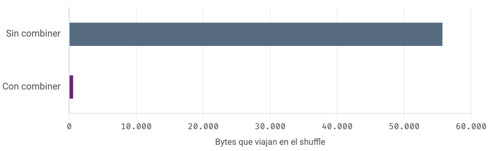
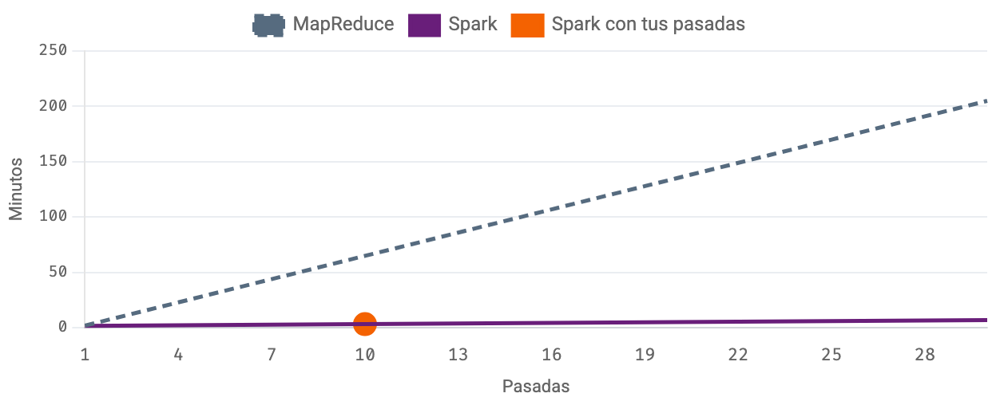
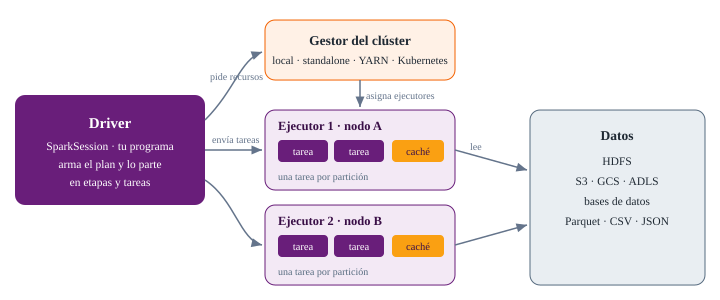
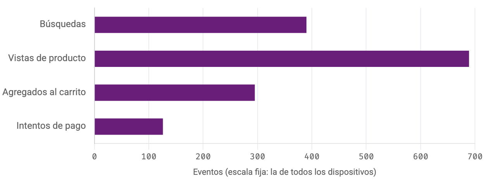

<!--
  Sesión 2 (4 h = 2 bloques de 105 min con un break de 30).
  Toda la sesión es en Colab: cada diapositiva de código corresponde a una
  celda del notebook (mismo identificador entre corchetes en el material).
  Ninguna celda se salta, porque Hadoop y Spark guardan estado entre celdas;
  lo que no cabe en el tiempo se quita de la explicación, no de la ejecución.
  Fuera de la presentación quedan los cuestionarios completos, los
  simuladores (se abren en vivo desde el enlace de cada divisor), las tablas
  de consulta, el glosario y las lecturas.
  Las diez preguntas del cierre (módulo 14) no se plantean antes: sus temas
  se enseñan, porque el material los enseña, y las notas marcan cada una.
-->

# Bienvenida y retorno al caso {seccion=modulo-1}

> En la sesión 1, todo corrió en una sola máquina. Hoy, los mismos programas en Hadoop y la misma limpieza en Spark.

???
Abrir con la quinta pregunta de la gerencia, que quedó pendiente en la sesión 1: si mañana los datos fueran mil veces más, ¿el mismo proceso seguiría funcionando? Hoy se responde con dos herramientas nuevas y con la misma lógica.

## Partimos de 2.969 ventas limpias y de tres caminos que dieron lo mismo

::: tarjetas
### Calidad
**3.029 → 2.969 filas.** Seis pasos de limpieza, cada uno con su dimensión de calidad; 31 filas en cuarentena.
### Información
**44,0 millones de pesos** en el semestre. La app pasó del 23,0 % de las ventas en enero al 35,9 % en junio.
### MapReduce
**Tres caminos, un resultado:** `groupby`, MapReduce en memoria y la tubería `mapper | sort | reducer`.
:::

Hoy sumamos dos caminos más: **Hadoop** y **Spark**.

???
Son las tarjetas «Dónde quedamos» del módulo 1. No hace falta el notebook de la sesión 1: la segunda celda del notebook de hoy repite la limpieza y deja listos `df` y `ventas_limpias.csv`.

## La gerencia dejó tres encargos, y hoy cumplimos dos

1. «Si mañana los datos fueran **mil veces más**, ¿el mismo proceso seguiría funcionando?» — hoy, con Hadoop y Spark
2. «Antes de publicar una cifra, **demuéstrennos que es correcta**» — hoy, en los módulos 4 y 11
3. «Queremos que cualquier analista consulte las ventas **con SQL**, sin pedirle el notebook a nadie y sin ver quién es cada cliente» — en la sesión 3

???
Para el segundo encargo, cada resultado se compara con el de un camino independiente: es el control de coherencia del CR3. El tercero no cabe hoy: abre la sesión 3, con la base de datos del caso. Las tarjetas «Los criterios, hoy» del módulo 1 quedan para lectura; en una frase: CR1, la huella del software y los permisos en HDFS; CR2, unir los eventos web con las ventas en el taller; CR3, Hadoop y Spark contra pandas.

## Cuatro horas en dos bloques de 105 minutos

::: flujo
1. **De MapReduce en Hadoop a Spark** — HDFS en Colab, Hadoop Streaming y el combiner, los límites de MapReduce, la arquitectura de Spark y los RDD (módulos 1 a 7)
2. **Datos tabulares y semiestructurados con Spark** — el DAG, DataFrames y SQL, esquemas, limpieza, uniones y ventanas, JSON anidado y el taller (módulos 8 a 14)
:::

Un break de **30 minutos** entre los dos bloques. Toda la sesión es en Colab.

???
Pedir que escriban la hora de inicio en la agenda del material: la agenda, la barra lateral y el reloj del modo presentación se ajustan a la hora real. La sesión va justa: las tablas de consulta y los desplegables quedan para lectura, pero ninguna celda se salta.

## Abre el notebook y lanza la descarga de Hadoop antes de calentar

::: flujo
1. **Abrir en Colab** — el botón del módulo 1; después, **Archivo → Guardar una copia en Drive**
2. **Ejecutar las tres primeras celdas** — los datos del caso, la limpieza de la sesión 1 y las versiones
3. **Lanzar `[hadoop_descarga]`** — la primera celda del módulo 2: baja unos 580 MB en uno o dos minutos
:::

::: warn El orden importa
Hadoop y Spark guardan estado entre celdas: si te saltas una, las siguientes fallan. Si Colab se reinicia: **Entorno de ejecución → Ejecutar anteriores**.
:::

???
La segunda celda va plegada: se ejecuta sin abrirla y debe imprimir `df: 2969 ventas limpias · total 44.0 millones de pesos`. Versiones de referencia: Python 3.13, pandas 2.2.3, PySpark 4.0.4 y Java 21; en Colab pueden variar. Si Colab recicló la máquina, «Ejecutar anteriores» repite también la descarga de Hadoop y vuelve a crear HDFS: tres o cuatro minutos. Si el enlace no abre: descargar el notebook y subirlo (Archivo → Subir notebook).

## ¿Qué garantía necesita el `reducer.py` de la sesión 1? {.pregunta}

Imprime el total de una ciudad cuando ve aparecer la siguiente. Para funcionar necesita…

- a) que haya un solo mapper
- b) que el archivo tenga encabezado
- c) que los totales sean enteros
- d) recibir las líneas ordenadas por clave

::: respuesta
**d) Recibir las líneas ordenadas por clave**: así todas las de una ciudad llegan seguidas. En la tubería local lo hacía `sort`; en Hadoop lo garantiza el *shuffle*, que junta y ordena lo que emitieron todos los mappers.
:::

???
Es la pregunta 2 del calentamiento «Cuatro preguntas de la sesión 1», en el módulo 1 (no se califica), con las opciones en el orden en que las ve el estudiante. Que respondan las cuatro mientras baja Hadoop, y comentar esta en voz alta antes de revelar. Pista: en la tubería local, ¿qué hacía `sort`? Las otras tres: el combiner es un reduce local en cada mapper; quitar duplicados es unicidad; 300 MB en bloques de 128 MB son 3 bloques.

# Hadoop en Colab {seccion=modulo-2}

> Hadoop no necesita un clúster para funcionar: el mismo software corre en tres modos, y solo cambia la configuración.

## Hoy, Hadoop pseudodistribuido: un clúster en una sola máquina

| Modo | Qué corre y dónde | Para qué |
|---|---|---|
| **Local** | Un solo proceso de Java, sin servicios, sobre el disco local | Probar un job rápido |
| **Pseudodistribuido** | NameNode y DataNode como procesos separados, en **una** máquina | Aprender con las órdenes de un clúster: **hoy, para HDFS** |
| **Totalmente distribuido** | Un NameNode y decenas o miles de DataNodes | Producción; en la nube, un clúster gestionado como EMR o Dataproc |

???
Los jobs de MapReduce no pasarán por YARN: los corre el modo local de MapReduce, leyendo de HDFS, como propone la guía oficial para un solo nodo. Las órdenes, los contadores y el resultado son los de un clúster; lo que no veremos es a YARN repartiendo contenedores, ni tareas corriendo a la vez. ¿Terminó la descarga? Debe decir `hadoop-3.5.0.tar.gz: 581 MB`.

## Antes de instalar, la huella comprueba que el archivo llegó intacto

```python [hadoop_integridad]
publicado = open(ARCHIVO + ".sha512").read().split("=")[-1].strip()
huella = hashlib.sha512()
with open(ARCHIVO, "rb") as f:
    for trozo in iter(lambda: f.read(1 << 20), b""):      # de a 1 MB
        huella.update(trozo)
print("¿Íntegro?", huella.hexdigest() == publicado)
#> ¿Íntegro? True
```

::: definicion Integridad no es autenticidad (CR1)
La huella SHA-512 cambia por completo si cambia un solo byte: garantiza que el archivo **llegó sin alteraciones**. Que lo publicó Apache lo garantiza su **firma digital** (`.asc`).
:::

???
Recortado: faltan `import hashlib`, el comentario y las dos líneas que imprimen el comienzo de cada huella (`04ab9449…`). `ARCHIVO` es el nombre que fijó `[hadoop_descarga]` (`hadoop-3.5.0.tar.gz`), y el `.sha512` bajó junto con él. Ejecutaremos como administrador un programa bajado de internet: si alguien lo hubiera alterado, estaríamos instalando su código (un ataque a la cadena de suministro). Si sale `False`, no instalar: borrar con `!rm -f hadoop-*.tar.gz*` y repetir la descarga. Después, `[hadoop_instala]` descomprime y fija `JAVA_HOME` y `HADOOP_HOME`; `root` aparece porque en Colab todo corre como administrador y Hadoop exige declararlo. La tabla «Si algo falla en Colab» del módulo 2 queda para consulta. Si Hadoop no arranca en el Colab de alguien, seguir: desde el módulo 6 todo funciona solo con Spark, salvo la lectura desde HDFS del módulo 9. Integridad frente a autenticidad es la pregunta 1 del cierre (en casa): enseñarla, no plantearla como pregunta.

# HDFS en la práctica {seccion=modulo-3}

> Los bloques y las réplicas que en la sesión 1 vimos en un simulador, ahora con órdenes reales.

## HDFS se configura con pares nombre → valor; hoy, con una sola réplica

```python [hdfs_config] {resaltar=3,6}
escribir_xml("core-site.xml", {"fs.defaultFS": "hdfs://localhost:9000"})
escribir_xml("hdfs-site.xml", {
    "dfs.replication": 1,
    "dfs.namenode.name.dir": f"file://{BASE}/nombres",
    "dfs.datanode.data.dir": f"file://{BASE}/bloques",
    "dfs.namenode.fs-limits.min-block-size": 65536,
})
```

- **Una réplica**: con un solo DataNode no hay dónde poner otra copia (en un clúster, 3)
- **Bloque mínimo de 64 KB**: solo para ver bloques con archivos pequeños; en producción no se toca
- Luego, `[hdfs_arranque]` arranca los dos servicios: debe aparecer `Live datanodes (1)`

???
Recortado: faltan las definiciones de `CONF` y `BASE`, la función `escribir_xml`, los comentarios y la impresión del XML. `core-site.xml` dice dónde está el NameNode (`localhost:9000`, esta misma máquina); `BASE` es la carpeta local donde cada servicio guarda lo suyo: HDFS es un sistema de archivos *encima* de los discos de cada máquina. `[hdfs_arranque]` formatea HDFS (una sola vez, como un disco nuevo), arranca NameNode y DataNode y espera a que el DataNode se reporte; `jps` lista los procesos de Java: NameNode, DataNode y el propio `jps`. Si no aparece `Live datanodes (1)`, repetir la celda. El desplegable sobre cómo leer bash queda para lectura: basta reconocer qué orden de Hadoop se ejecuta.

## `ventas.csv` quedó en 4 bloques; el último, de 336 bytes

```shell [hdfs_subir]
hdfs dfs -mkdir -p /guadua/crudo /guadua/limpio
hdfs dfs -D dfs.blocksize=65536 -put -f datos/ventas.csv /guadua/crudo/
```

```text Salida de [hdfs_fsck]
0. blk_1073741827_1003 len=65536 Live_repl=1  …
1. blk_1073741828_1004 len=65536 Live_repl=1  …
2. blk_1073741829_1005 len=65536 Live_repl=1  …
3. blk_1073741830_1006 len=336 Live_repl=1  …
Status: HEALTHY
```

196.944 bytes en bloques de 65.536 bytes: **4 bloques**. Un bloque no ocupa el tamaño máximo si el archivo no lo llena.

???
Recortado: `[hdfs_subir]` también sube productos, logs y `ventas_limpias.csv` y lista los tamaños con `-du -h`; faltan además sus comentarios. Antes de `[hdfs_fsck]`, `[hdfs_bloques]` muestra con `-stat` el tamaño (196.944 bytes), el bloque (65.536) y la replicación (1) de `ventas.csv`, de donde salen los 4 bloques; productos y logs usan el bloque por defecto de 128 MB y caben en uno. En la salida de `[hdfs_fsck]` se quitaron la dirección del DataNode al final de cada bloque (`127.0.0.1:9866`) y el total. Los `blk_…` cambian de un Colab a otro y cada vez que se repite la subida; lo estable son los 4 bloques y los 336 bytes del último. `HEALTHY`: ningún bloque falta ni está dañado. La tabla de órdenes HDFS ↔ Linux del módulo 3 queda para consulta: `-ls`, `-mkdir`, `-put`, `-get`, `-cat`, `-du`, `-rm`, `-chmod`.

## Los permisos 750 cierran lo crudo, pero HDFS no comprueba quién pide

```shell [hdfs_permisos]
hdfs dfs -chmod -R 750 /guadua/crudo
hdfs dfs -stat "%A  %u:%g  %n" /guadua/crudo /guadua/limpio
#> rwxr-x---  root:supergroup  crudo
#> rwxr-xr-x  root:supergroup  limpio
```

7 = `rwx` para el dueño · 5 = `r-x` para su grupo · 0 = nada para los demás.

::: warn Sin autenticación, un permiso no basta
Por defecto, HDFS da por cierto el nombre de usuario que declara el cliente. Con datos personales hacen falta autenticación (**Kerberos**), autorización por tabla y columna, **cifrado** y **auditoría**: el principio de seguridad de la Ley 1581.
:::

???
Recortado el comentario. En Colab no se nota: `root` arrancó el NameNode y por eso es el superusuario de HDFS, y a los superusuarios los permisos no los detienen. En un clúster real el dueño sería una cuenta de servicio y el grupo, el del equipo de datos (`-chown -R etl:datos`). La autorización por tabla y columna la da una herramienta como Apache Ranger; el principio de seguridad es el literal g del artículo 4 de la Ley 1581. Es materia del punto 4 del taller y de la pregunta 2 del cierre (en casa): enseñarlo, no plantearlo como pregunta.

## `ventas.csv` en un clúster de verdad: ¿cuántos bloques y cuántos bytes? {.pregunta}

Bloques de **128 MB** y replicación **3**. El archivo pesa **196.944 bytes**.

::: respuesta
**Un bloque**, con tres copias en tres DataNodes: **590.832 bytes** en total, no 3 × 128 MB, porque un bloque solo ocupa lo que contiene. HDFS rinde mal con millones de archivos pequeños, pero no por el disco: el NameNode guarda en memoria una entrada por cada archivo y cada bloque.
:::

???
Es el ejercicio del final del módulo 3. Pista: ¿cómo es el tamaño del archivo frente al del bloque? Antes de pasar, ejecutar `[hdfs_leer]`: `-head` lee las primeras líneas sin descargar el archivo y `-count` resume la carpeta (3 carpetas, 4 archivos, 555,6 KB).

# Hadoop Streaming {seccion=modulo-4}

> Hadoop está escrito en Java, pero su modo Streaming acepta como mapper y reducer cualquier programa que lea y escriba texto.

## Los dos programas de la sesión 1 entran a Hadoop sin cambiar una línea {columnas=1:1}

```python [mapper_py]
%%writefile mapper.py
import sys

for linea in sys.stdin:
    ciudad, total = linea.strip().split(",")
    if ciudad == "ciudad":
        continue
    print(f"{ciudad}\t{total}")
```

|||

```python [reducer_py]
%%writefile reducer.py
import sys

actual, suma = None, 0.0
for linea in sys.stdin:
    clave, valor = linea.rstrip("\n").split("\t")
    if clave != actual:
        if actual is not None:
            print(f"{actual}\t{suma:.0f}")
        actual, suma = clave, 0.0
    suma += float(valor)
if actual is not None:
    print(f"{actual}\t{suma:.0f}")
```

???
Recortados solo los comentarios: los de cabecera (`# MAPPER: …`, `# REDUCER: …`) y el que explica que el `if` salta el encabezado. Las dos celdas escriben los archivos. El reducer acumula mientras la clave no cambie: por eso necesita las líneas ordenadas, como vimos en el calentamiento.

## Hadoop les pasa las líneas por la entrada estándar y recoge los pares

```shell [streaming_job]
hdfs dfs -rm -r -f -skipTrash /guadua/resultados/por_ciudad > /dev/null
hadoop jar $HADOOP_HOME/share/hadoop/tools/lib/hadoop-streaming-*.jar \
  -files mapper.py,reducer.py \
  -mapper "python3 mapper.py" \
  -reducer "python3 reducer.py" \
  -input /guadua/limpio/ventas_limpias.csv \
  -output /guadua/resultados/por_ciudad 2> job.log || tail -n 20 job.log
#> Map input records=2970
#> Map output records=2969
#> Reduce input groups=7
```

**2.970** líneas leídas, con el encabezado · **2.969** pares, uno por venta · **7** claves: seis ciudades y «Sin dato». La carpeta de salida **no puede existir de antemano**: por eso se borra antes.

???
Recortado: faltan los comentarios y la línea que filtra los contadores (`sed … job.log | grep …`). El registro del job va a `job.log`, así que los tres contadores que se ven los imprime esa línea; se quitaron además `Reduce output records=7` y la sangría. Faltan también las líneas que listan y muestran el resultado. `_SUCCESS`, vacío, marca que el job terminó bien; `part-00000` trae las siete ciudades. Hay un archivo `part-` por reducer. La tabla de opciones de Streaming del módulo 4 queda para consulta. Insistir en leer siempre los contadores: son el informe del job.

## Hadoop dio lo mismo que pandas: diferencia cero en las siete ciudades {columnas=3:2}

| Ciudad | Hadoop | pandas | Diferencia |
|---|---|---|---|
| Barranquilla | 5.863.470 | 5.863.470 | 0 |
| Bogotá | 14.619.650 | 14.619.650 | 0 |
| Bucaramanga | 4.331.705 | 4.331.705 | 0 |
| Cali | 7.013.590 | 7.013.590 | 0 |
| Cartagena | 3.566.865 | 3.566.865 | 0 |
| Medellín | 8.443.795 | 8.443.795 | 0 |
| Sin dato | 115.415 | 115.415 | 0 |

|||

Hadoop no «sabe» que su resultado es correcto: **lo sabemos nosotros**, porque lo comparamos con un camino independiente.

Es el control de coherencia del **CR3**.

???
La celda `[streaming_verifica]` lee el `part-00000` desde HDFS, lo compara con `df.groupby("ciudad")` y arma esta tabla (en el notebook, sin separador de miles). Es la primera respuesta al segundo encargo de la gerencia: «demuéstrennos que es correcta».

## ¿Por qué el propio `reducer.py` puede hacer de combiner? {.pregunta}

El siguiente job usa el mismo `reducer.py` dos veces: como reducer y como combiner, dentro de cada mapper. ¿Qué lo permite?

::: respuesta
**Sumar es asociativo y conmutativo**: da igual sumar por partes y en cualquier orden. Y `reducer.py` **escribe en el mismo formato que lee**, `clave<TAB>valor`. Como Hadoop puede aplicar el combiner cero, una o varias veces, solo sirve uno que no cambie el resultado.
:::

???
Antes, `[streaming_partes]` parte las ventas limpias en cuatro archivos, como los cuatro bloques de la sesión 1: Hadoop lanza un mapper por archivo (*split*). En Colab, el modo local corre las cuatro tareas una tras otra; en un clúster correrían a la vez. Pista para la pregunta: ¿serviría un promedio como combiner? No: un promedio de promedios no es el promedio. Por si alguien lo nota: `reducer.py` redondea cada suma con `:.0f`; aquí no cambia nada porque los totales son pesos enteros, pero con centavos ese redondeo en el combiner sí alteraría el resultado.

## Con combiner, el shuffle baja de 55.709 a 582 bytes: un 99,0 % menos

{alto=230}

| `[streaming_combiner]` | Map output records | Reduce input records | Reduce shuffle bytes |
|---|---|---|---|
| **Sin combiner** | 2.969 | 2.969 | 55.709 |
| **Con combiner** | 2.969 | **28** | **582** |

???
Es el mismo job dos veces, sobre las cuatro partes y con dos reducers; al final, la celda compara las dos salidas: `== mismo resultado con y sin combiner`. Aquí cada mapper envía a lo sumo siete subtotales; no hacer en voz alta la cuenta de los 28: es la pregunta 3 del cierre (en casa). En Colab esos bytes se copian dentro de la misma máquina; en un clúster viajarían por la red, el recurso más lento. Con dos reducers hay dos archivos (`[streaming_reducers]`): Bogotá, Cali y Medellín caen en `part-00000`; las demás, en `part-00001`, según el *hash* de la ciudad. En el taller, con dos reducers hay que leer todas las partes (`part-*`). El ejercicio del módulo 4 (contar ventas por ciudad emitiendo `ciudad<TAB>1`) queda para el trabajo independiente: prepara el mapper nuevo del punto 1 del taller.

# Lo que Hadoop resolvió y lo que no {seccion=modulo-5}

> Antes de pasar a Spark, conviene ser justos con lo que logró MapReduce y claros con lo que le costaba.

## MapReduce escaló con máquinas comunes; su precio fue el disco

::: tarjetas
### Lo que resolvió
- Procesar petabytes en miles de computadores baratos
- Llevar el cálculo a donde están los datos
- Tolerar fallos: tareas que se repiten y bloques con réplicas
### Lo que le costaba
- Cada job lee de HDFS y escribe en HDFS, con réplicas: diez pasos, diez viajes al disco
- Arrancar un job toma segundos: no sirve para consultas interactivas
- Hasta un `JOIN` exige encadenar mappers y reducers
:::

???
El peor caso son los algoritmos iterativos —casi todo el aprendizaje automático y los algoritmos sobre grafos—: recorren los mismos datos una y otra vez, y con MapReduce cada pasada vuelve a leer y a escribir todo en disco. La idea de Spark fue sencilla: leer una vez y mantener los datos en memoria entre pasos.

## Con cada pasada, MapReduce suma tiempo y Spark casi no se mueve

{alto=360}

Siempre que los datos **quepan en memoria** y el código los guarde con `cache()`. Si no caben, Spark pierde buena parte de su ventaja.

???
Abrir el simulador del módulo 5 en vivo: con una sola pasada la diferencia es modesta, porque ambos leen de disco; al bajar la memoria del clúster por debajo del tamaño de los datos, Spark vuelve a leer de disco lo que no cabe. Spark no «es más rápido» siempre: lo es cuando reutiliza datos que caben en memoria. El porqué de la gráfica (Spark lee una vez y repite en memoria; MapReduce vuelve al disco en cada pasada) decirlo de palabra, sin plantearlo como pregunta: es la pregunta 4 del cierre (en casa). Si el tiempo apremia, este simulador es de lo primero que se puede saltar.

## Spark no reemplazó a Hadoop: reemplazó a MapReduce {.idea icono=fa-layer-group}

Spark corre sobre **YARN** (o Kubernetes) y lee y escribe en **HDFS** (o en el almacenamiento de la nube). Cambió el motor de procesamiento, no el almacenamiento.

???
En el módulo 9 lo comprobamos: Spark leerá el `ventas.csv` que acabamos de subir a nuestro HDFS.

# Spark: el ecosistema {seccion=modulo-6}

> Nació en 2009 en Berkeley para resolver justo lo que acabamos de ver.

## Spark trabaja en memoria, unifica lotes y SQL, y se usa desde Python

::: tarjetas
### En memoria
Entre un paso y otro, los resultados intermedios no van a HDFS; los datos que se reutilizan pueden quedarse en la memoria.
### Unificado
Lotes, SQL, flujos en tiempo real y aprendizaje automático, con el mismo motor y los mismos datos.
### Varios lenguajes
Scala (en el que está escrito), Java, SQL y Python. Desde Python se usa con **PySpark**.
:::

Spark no administra máquinas: le pide recursos a un **gestor de clúster** (`local`, *standalone*, YARN o Kubernetes). Cambiar de gestor no cambia el código.

???
Lo creó Matei Zaharia en el AMPLab de la Universidad de California en Berkeley; es proyecto de Apache desde 2013. «En memoria» tiene un matiz: el shuffle sí deja archivos temporales en el disco local. Quedan para lectura el simulador «Las piezas de Spark», el apartado «¿Dónde se ejecuta Spark?» (de él solo se proyecta la frase del gestor) y la nota «Si trabajas fuera de Colab» (Java 17 o 21, `pip install pyspark` y la Spark UI en el puerto 4040). En la nube se usa casi siempre como PaaS: Databricks, EMR, Dataproc, HDInsight o Fabric. Es el módulo más holgado del bloque 1: sirve de colchón si la descarga o HDFS se demoraron.

## Todo programa de Spark empieza por una `SparkSession`

```python [spark_sesion]
spark = (SparkSession.builder
         .appName("tiendas-guadua")
         .master("local[*]")
         .config("spark.sql.session.timeZone", "America/Bogota")
         .getOrCreate())
sc = spark.sparkContext
sc.setLogLevel("ERROR")
print("Spark", spark.version,
      "· núcleos disponibles:", sc.defaultParallelism)
#> Spark 4.0.4 · núcleos disponibles: 2
```

- `local[*]`: en esta máquina, con un hilo de trabajo por núcleo
- Zona horaria de Bogotá: fechas y horas de Colombia, no la hora universal del servidor
- **2 núcleos**: un clúster en miniatura, con dos tareas a la vez

???
Recortados los dos `import` (`SparkSession` y `functions as F`) y los comentarios; el último `print` va partido en dos líneas. La versión y el número de núcleos dependen de la máquina que asigne Colab (la gratuita suele dar 2); `local[*]` usa todos los que haya. `setLogLevel("ERROR")`: el registro interno de Java solo mostrará errores. El mismo código, en un clúster de cien nodos, correría cientos de tareas en paralelo: cambia la línea `master`, no el resto.

# Arquitectura y RDD {seccion=modulo-7}

> ¿Quién hace qué cuando Spark ejecuta tu programa, y en cuántos trozos reparte el trabajo?

## El driver arma el plan; los ejecutores corren una tarea por partición

{alto=430}

???
El driver ejecuta el programa: lo convierte en un plan, lo parte en etapas (módulo 8) y cada etapa en tareas, y recibe los resultados de las acciones; por eso `collect()` o `toPandas()` traen los datos al driver. El gestor asigna máquinas y memoria. Los ejecutores corren las tareas y pueden guardar datos en caché. En Colab, con `local[*]`, driver y ejecutor son un mismo proceso de Java, y cada núcleo es un hilo que ejecuta una tarea a la vez.

## La partición es la unidad de paralelismo: una tarea por partición {.codigo-grande}

```python [rdd_particiones]
numeros = sc.parallelize(range(1, 11), 4)
print("Particiones:", numeros.getNumPartitions())
print(numeros.glom().collect())
#> Particiones: 4
#> [[1, 2], [3, 4, 5], [6, 7], [8, 9, 10]]
```

Un **RDD** (*Resilient Distributed Dataset*) es una colección repartida en particiones. La partición **no es el bloque**: el bloque es cómo HDFS guarda el archivo; la partición, cómo Spark reparte el trabajo.

???
Recortados los comentarios. `glom` muestra el contenido de cada partición. El RDD es la estructura más básica de Spark: una colección de objetos repartida en particiones, que se puede recalcular si se pierde una. Las particiones son el equivalente de los *splits* que MapReduce entrega a cada mapper. Abrir el simulador «¿Cuántas particiones?» del módulo 7: con menos particiones que núcleos hay núcleos ociosos; con miles de particiones diminutas, el costo de arranque se come la ganancia. La guía de Spark recomienda dos o tres tareas por núcleo.

## 8 particiones, 2 núcleos y 10 segundos por tarea: ¿cuánto tarda la etapa? {.pregunta}

Cada núcleo ejecuta una tarea a la vez.

::: respuesta
**40 segundos.** Con 2 núcleos, las 8 tareas corren en **4 oleadas** de 2: 4 × 10 s. Con 3 núcleos serían 3 oleadas (30 s), y la última quedaría a medias.
:::

???
Es la pregunta 4 del control «Spark por dentro», al final del módulo 9: que la respondan en voz alta o en el chat antes de revelar; en el módulo 9 la marcarán en el cuestionario. Pista: ¿cuántas oleadas hacen falta? En el simulador del módulo 7, con 8 particiones y 2 núcleos, se ven las 4 oleadas.

## El conteo de palabras de la sesión 1, en tres transformaciones

```python [rdd_conteo] {resaltar=3-5}
textos = pd.read_csv("datos/resenas.csv")["texto"].tolist()
lineas = sc.parallelize(textos, 4)
conteo = (lineas.flatMap(lambda t: re.findall(r"[a-záéíóúüñ]+", t.lower()))
                .map(lambda palabra: (palabra, 1))
                .reduceByKey(lambda a, b: a + b))
print("Palabras distintas:", conteo.count())
conteo.takeOrdered(8, key=lambda par: (-par[1], par[0]))
#> Palabras distintas: 209
#> [('el', 32), ('y', 23), ('la', 21), ('en', 20), ('de', 12), ('muy', 9),
#>  ('llegó', 8), ('app', 7)]
```

`flatMap` y `map` hacen de mapper; `reduceByKey`, de shuffle y reduce, **con el combiner incorporado**. Contra Python puro (`[rdd_verifica]`): `True`.

???
Recortados `import re` y los comentarios; la lista de salida va partida en dos líneas. A diferencia de Hadoop, Spark no entrega las claves ordenadas: por eso `takeOrdered`. `[rdd_verifica]`, la celda siguiente, compara con un `Counter` de Python puro: las mismas 209 palabras y los mismos conteos de la sesión 1. La tabla «Sesión 1, a mano ↔ Spark» está en el módulo 7. Aquí termina el bloque 1.

## Break de 30 minutos {.idea etiqueta="Break" icono=fa-mug-hot}

Al volver: por qué Spark no hace nada hasta que se lo exigen, y cómo pasar de los RDD a tablas con esquema.

???
Si Colab reinició la sesión durante el break, pedir que vayan a la celda en la que iban y usen **Entorno de ejecución → Ejecutar anteriores**. Si la máquina se recicló, eso repite la descarga de Hadoop y vuelve a crear HDFS: tres o cuatro minutos.

# Transformaciones y DAG {seccion=modulo-8}

> Las operaciones de Spark son de dos clases, y confundirlas es la fuente de muchas sorpresas.

## Las transformaciones anotan; las acciones ejecutan

```python [perezosa] {resaltar=1,3-4}
largas = lineas.filter(lambda t: len(t) > 60).map(lambda t: t.upper())
print(type(largas).__name__, "· aún sin ejecutar")
print("Reseñas de más de 60 caracteres:", largas.count())
print(largas.take(1))
#> PipelinedRDD · aún sin ejecutar
#> Reseñas de más de 60 caracteres: 32
#> ['EXCELENTE SERVICIO Y EXCELENTE CALIDAD. SEGUIRÉ COMPRANDO EN CARTAGENA.']
```

- **Transformaciones** (`map`, `filter`, `select`, `groupBy`…): devuelven un plan nuevo, sin calcular nada
- **Acciones** (`count`, `collect`, `take`, `show`, `write`…): obligan a ejecutar lo anotado
- Sin `cache()`, cada acción recalcula desde el origen

???
Recortados los comentarios. La primera línea respondió al instante sin leer una sola reseña; `count()` hizo trabajar a Spark, y `take(1)` lo hizo de nuevo. Es la ejecución perezosa, y es a propósito: como Spark ve el plan completo antes de ejecutarlo, puede optimizarlo (aquí, `filter` y `map` recorren cada reseña una sola vez). Esta diapositiva responde la pregunta 1 del control «Spark por dentro» (cuál es una acción).

## ¿Cuáles provocan un shuffle y abren una etapa nueva? {.pregunta}

Marca todas: a) `map` · b) `filter` · c) `reduceByKey` · d) `groupBy("ciudad").agg(...)` · e) un `join` entre dos tablas grandes

::: respuesta
**c, d y e: `reduceByKey`, `groupBy().agg()` y el `join`**. Necesitan reunir las filas de una misma clave, que están repartidas. `filter` y `map` deciden fila por fila, dentro de cada partición.
:::

???
Es la pregunta 2 del control «Spark por dentro» (final del módulo 9), con las opciones en el orden en que las ve el estudiante: que la respondan en voz alta o en el chat antes de revelar. Pista: ¿necesita la operación ver filas que están en otras particiones? La retroalimentación del material añade que, con una tabla pequeña, el join de difusión evita el shuffle: no adelantarlo, es la pregunta 9 del cierre (en clase).

## Cada shuffle corta el trabajo y abre una etapa nueva

| Angostas: sin shuffle | Anchas: con shuffle, nueva etapa |
|---|---|
| `map`, `flatMap`, `filter` | `reduceByKey`, `groupByKey` |
| `select`, `withColumn`, `where` | `groupBy().agg()`, `distinct`, `dropDuplicates` |
| `union` | `join` (salvo el de difusión), `orderBy`, `repartition` |

Una angosta trabaja dentro de cada partición; una ancha reúne datos de todas. No confundas estas *etapas* (*stages*) con las seis etapas del ciclo de la sesión 1.

???
Abrir el simulador «Arma un trabajo y mira sus etapas» del módulo 8: mientras no hay acción, no se ejecuta nada. Probar la misma cuenta con `groupByKey` y con `reduceByKey`: ambas abren una etapa, pero `reduceByKey` suma dentro de cada partición antes de enviar, como el combiner del módulo 4, y por eso viajan muchos menos datos.

## El linaje es la receta: con ella Spark recalcula solo lo que se pierde

```python [linaje] {resaltar=5}
print(conteo.toDebugString().decode())
#> (4) PythonRDD[9] at collect at rdd_verifica:5 []
#>  |  MapPartitionsRDD[6] at mapPartitions at PythonRDD.scala:169 []
#>  |  ShuffledRDD[5] at partitionBy at …
#>  +-(4) PairwiseRDD[4] at reduceByKey at rdd_conteo:8 []
#>     |  PythonRDD[3] at reduceByKey at rdd_conteo:8 []
#>     |  ParallelCollectionRDD[2] at readRDDFromFile at …
```

- Se lee **de abajo hacia arriba**; `+-` marca el shuffle: lo de debajo es la primera etapa
- Ese grafo de pasos, cortado en etapas, es el **DAG** (*grafo acíclico dirigido*)

???
Recortado: el final de dos líneas (`NativeMethodAccessorImpl.java:0` y `PythonRDD.scala:298`) y los comentarios. Los números entre corchetes y los nombres de celda cambian en cada Colab. PySpark junta en un solo `PythonRDD` las funciones de Python que pueden ir seguidas (el `flatMap`, el `map` y la suma local de `reduceByKey`): por eso no aparecen con su nombre. Para qué sirve: si un ejecutor muere, Spark recalcula con el linaje solo las particiones perdidas, sin replicarlo todo como HDFS. Decirlo de palabra, sin plantear el caso del ejecutor caído: es la pregunta 5 del cierre (en casa). Si se va tarde, esta diapositiva se puede saltar; la celda se ejecuta igual.

# DataFrames y Spark SQL {seccion=modulo-9}

> Un RDD no sabe qué hay dentro de sus objetos. Un DataFrame sí: tiene esquema.

## Spark adivinó los tipos y, como en pandas, `precio_unitario` quedó como texto

```python [df_crudo] {resaltar=5,11}
crudo = spark.read.csv("datos/ventas.csv", header=True, inferSchema=True)
crudo.printSchema()
#> root
#>  |-- id_venta: string (nullable = true)
#>  |-- fecha: string (nullable = true)
#>  |-- ciudad: string (nullable = true)
#>  |-- canal: string (nullable = true)
#>  |-- id_cliente: string (nullable = true)
#>  |-- id_producto: string (nullable = true)
#>  |-- cantidad: integer (nullable = true)
#>  |-- precio_unitario: string (nullable = true)
#>  |-- descuento: double (nullable = true)
#>  |-- metodo_pago: string (nullable = true)
```

Acertó con `cantidad` y `descuento`; precio y fecha quedaron como texto, el mismo diagnóstico de `ventas.info()` en la sesión 1. Los precios como `$12.900` y las fechas como `01/01/2025` siguen ahí.

???
Recortado el comentario. Un DataFrame es una tabla distribuida con esquema; como Spark sabe qué columnas hay, su optimizador (Catalyst) reescribe el plan y el trabajo corre dentro de Java, sin pasar por Python. Con `inferSchema=True`, Spark recorre el archivo para adivinar: es una excepción a la pereza, porque lee en ese momento (por eso en el módulo 10 le daremos el esquema escrito). `[df_mostrar]` muestra las cinco primeras filas: la V00005 trae la fecha como `01/01/2025` y el cliente como `NULL`.

## SQL y Python le piden trabajo al mismo motor, y la suciedad sigue ahí {columnas=1:1}

```python [df_sql]
crudo.createOrReplaceTempView("ventas_crudas")
spark.sql("""
    SELECT ciudad, COUNT(*) AS filas
    FROM ventas_crudas
    GROUP BY ciudad
    ORDER BY filas DESC, ciudad
    LIMIT 8
""").show()
```

|||

```text Salida de [df_sql]
+------------+-----+
|      ciudad|filas|
+------------+-----+
|      Bogotá|  969|
|    Medellín|  547|
|        Cali|  413|
|Barranquilla|  360|
| Bucaramanga|  282|
|   Cartagena|  249|
| Bogotá D.C.|   19|
|      bogota|   18|
+------------+-----+
```

???
Recortado el comentario. Una **vista temporal** es un nombre para consultar el DataFrame con SQL: no copia los datos y desaparece al cerrar la sesión de Spark. Para la misma pregunta, Catalyst produce el mismo plan en SQL y en Python. Antes, `[df_canal]`: contar por canal se escribe casi igual que en pandas y devuelve las nueve grafías de la sesión 1 (Tienda, tienda, TIENDA, App, APP…). Spark no limpia por nosotros: en el módulo 11 repetimos la limpieza. La tabla pandas ↔ PySpark del módulo 9 queda para consulta; la diferencia de fondo es que los DataFrames de Spark son inmutables: cada operación devuelve uno nuevo, que se vuelve a asignar.

## Spark lee de HDFS: Hadoop almacena y Spark procesa

```python [df_hdfs]
desde_hdfs = spark.read.csv("hdfs://localhost:9000/guadua/crudo/ventas.csv",
                            header=True)
print("Filas leídas desde HDFS:", desde_hdfs.count())
print("Particiones en Spark:", desde_hdfs.rdd.getNumPartitions())
#> Filas leídas desde HDFS: 3029
#> Particiones en Spark: 1
```

En HDFS, `ventas.csv` ocupa **4 bloques**; Spark lo leyó en **1 partición**.

???
Recortado el comentario; la primera línea va partida en dos. Cierra el círculo con el bloque 1: la misma función, cambiando la ruta. Por qué una partición: Spark arma sus particiones por tamaño, y con 196.944 bytes no vale la pena repartirlo más. Decirlo de palabra, sin plantearlo como pregunta: es la pregunta 6 del cierre (en casa). En un clúster real, Spark además intentaría ejecutar cada tarea en el DataNode que tiene el bloque, como MapReduce. Si Hadoop no arrancó en algún Colab, esta es la única celda de Spark que falla: seguir.

## Desde Python, ¿por qué un DataFrame suele ser más rápido que un RDD? {.pregunta}

- a) Porque Spark conoce sus columnas, optimiza el plan y no pasa cada fila por Python
- b) Porque los DataFrames siempre caben en memoria
- c) Porque los RDD solo funcionan con texto
- d) Porque los DataFrames no usan particiones

::: respuesta
**a) Spark conoce sus columnas**: con el esquema, Catalyst, el optimizador de Spark, reescribe el plan y el trabajo corre dentro de Java. Con un RDD, cada objeto pasa por una función de Python que Spark no puede ver por dentro ni optimizar.
:::

???
Por eso los DataFrames son la forma recomendada de usar Spark. Es la pregunta 3 del control «Spark por dentro», al final de este módulo, con las opciones en el orden en que las ve el estudiante. Pista: ¿quién sabe qué hay dentro de los datos, y dónde se ejecuta el trabajo? Después de revelar, es el momento de marcar las cuatro preguntas del control en el material: la 2 y la 4 ya salieron en clase, y la 1 (cuál es una acción) la respondió la diapositiva de transformaciones y acciones.

# Leer con esquema {seccion=modulo-10}

> Un día llega un precio con «$» y la columna entera pasa a texto, sin que nadie se entere.

## Declarar el esquema hace visibles las 74 filas que no lo cumplen

```python [esquema_estricto] {resaltar=1-2}
con_registro = StructType(ESQUEMA.fields
                          + [StructField("_corrupt_record", StringType())])
estricto = spark.read.csv("datos/ventas.csv", header=True,
                          schema=con_registro).cache()
malas = estricto.filter(F.col("_corrupt_record").isNotNull())
print("Filas que no cumplen el esquema:", malas.count())
#> Filas que no cumplen el esquema: 74
```

- `ESQUEMA` declara diez columnas con su tipo: `precio_unitario`, **entero**; la fecha, texto, porque llega en dos formatos
- `_corrupt_record` guarda la línea tal cual, `…,P016,3,$3.100,0,…`: nada se pierde

???
Recortado: faltan el `import`, la definición de `ESQUEMA` (diez `StructField`), los comentarios y la línea que muestra tres filas malas (V00049, V00212 y V00231, todas con el precio escrito como `$…`); las dos asignaciones largas van partidas. Adivinar los tipos tiene dos problemas en un proceso que corre cada noche: obliga a leer los datos una vez de más, y el resultado cambia si cambian los datos. El esquema declarado es un contrato.

## 74 filas no cumplen el esquema. ¿Cuántas deja cada modo de lectura? {.pregunta}

| Modo | Qué hace con la fila que no cumple |
|---|---|
| `PERMISSIVE` (por defecto) | La conserva y pone nulo en el campo que no encaja |
| `DROPMALFORMED` | La descarta |
| `FAILFAST` | Detiene todo con un error |

::: respuesta
```text Salida de [modos]
PERMISSIVE    → 3029 filas · 74 precios nulos
DROPMALFORMED → 2955 filas · 0 precios nulos
FAILFAST      → ERROR [MALFORMED_RECORD_IN_PARSING.WITHOUT_SUGGESTION] …
```
Elegir el modo es una decisión de **calidad**, no un detalle técnico.
:::

???
Es la pregunta que el propio módulo 10 hace «antes de ejecutar»: que la anoten y luego ejecuten `[modos]`. La salida va recortada. El mensaje de `FAILFAST` sigue, y la última línea muestra la trampa: sin `cache()`, `count()` no interpreta las columnas y `DROPMALFORMED` cuenta 3.029 filas. La advertencia «Una trampa» del módulo queda para lectura. Comentar el riesgo de `PERMISSIVE` (nulos que parecen dato faltante) y el de `FAILFAST` (un registro detiene todo), pero no el de `DROPMALFORMED`: es la pregunta 7 del cierre, que se responde en clase en el módulo 14.

## Bronce, plata y oro: ninguna capa tiene que resolverlo todo

::: tarjetas
### Bronce
**Tal como llegó.** Todo como texto: ninguna fila falla al leerse y siempre se puede volver a empezar.
### Plata
**Limpio y validado.** Tipos correctos, reglas de calidad y cuarentena aparte: el módulo 11.
### Oro
**Listo para el negocio.** Tablas resumidas, en el taller 2, o seudonimizadas, en la sesión 3.
:::

`[bronce]` relee el archivo con todas las columnas como texto: **3.029 filas**, ninguna perdida.

???
Es la llamada arquitectura de medallón. Con la bronce, la validación pasa de la lectura al paso siguiente, donde cada problema se trata con una regla explícita. Para profundizar, la lectura de Microsoft Learn sobre la arquitectura de medallón (módulo 14).

# Limpieza en Spark {seccion=modulo-11}

> Las mismas seis reglas de la sesión 1, con las mismas dimensiones de calidad. Cambia el vocabulario.

## Las reglas de la sesión 1 se traducen una a una a PySpark

| Dimensión | pandas (sesión 1) | PySpark (hoy) |
|---|---|---|
| Unicidad | `drop_duplicates()` | `dropDuplicates()` |
| Consistencia | `str.strip().str.lower()`, `map(dicc)` | `F.trim`, `F.lower`, `F.create_map` |
| Validez | `pd.to_numeric`, `pd.to_datetime` | `.try_cast("int")`, `F.try_to_timestamp` |
| Exactitud | `between(1, 50)` | `F.col(…).between(1, 50)` |
| Completitud | `fillna(…)` | `fillna({…})` |

Unicidad, `[sp_duplicados]`: **3.029 → 3.000** filas; 29 duplicadas, como en la sesión 1.

???
La tabla completa, con las tildes (`str.normalize` ↔ `F.translate`) y la validez de precios y fechas por separado, está al principio del módulo 11. Se parte de la capa bronce, con todo como texto: `[sp_duplicados]` crea `v = bronce.dropDuplicates()`, la tabla de trabajo que cada paso siguiente reasigna.

## Antes de mapear las ciudades, se cuentan las grafías sin regla

```python [sp_texto] {resaltar=4-6}
mapa_ciudades = F.create_map(*[F.lit(x) for par in CIUDAD_CANONICA.items()
                               for x in par])
norma = F.translate(F.lower(F.trim("ciudad")), "áéíóúü", "aeiouu")
sin_regla = v.filter(F.col("ciudad").isNotNull()
                     & mapa_ciudades[norma].isNull())
print("Grafías sin regla:", sin_regla.select(norma).distinct().count())
v = (v.withColumn("ciudad",
                  F.coalesce(mapa_ciudades[norma], F.lit("Sin dato")))
      .withColumn("canal", F.initcap(F.trim("canal"))))
#> Grafías sin regla: 0
```

Si mañana llega «Medellín D.E.», salta a la vista; sin el control, se volvería «Sin dato» sin que nadie lo notara.

???
Recortados los comentarios y el conteo final por canal (App 938, Tienda 1.349, Web 713, los de la sesión 1); tres líneas largas van partidas. `CIUDAD_CANONICA` es el diccionario de la sesión 1, que trae la celda plegada del módulo 1; `create_map` pide `clave1, valor1, clave2, valor2…`: por eso se aplana. La normalización es la de la sesión 1: sin espacios sobrantes, en minúsculas y sin tildes.

## Spark 4 prefiere un error a inventar un nulo: el nulo se pide con `try_`

::: warn Modo ANSI, activo por defecto desde Spark 4
Un valor que no se puede convertir es un **error** (`CANNOT_PARSE_TIMESTAMP`), no un nulo. `[sp_ansi]` lo provoca a propósito.
:::

```python [sp_fechas]
iso = F.try_to_timestamp("fecha", F.lit("yyyy-MM-dd"))
dma = F.try_to_timestamp("fecha", F.lit("dd/MM/yyyy"))
v = v.withColumn("fecha", F.coalesce(iso, dma).cast("date"))
print("Fechas sin interpretar:", v.filter(F.col("fecha").isNull()).count())
#> Fechas sin interpretar: 0
```

Cada formato se prueba de forma explícita; lo que no encaje en ninguno queda nulo **y se cuenta**.

???
Antes de `[sp_fechas]` van dos celdas: `[sp_ansi]` provoca el error con dos fechas de ejemplo, y `[sp_precios]` convierte los precios con la misma expresión regular de la sesión 1 y deja 0 sin convertir. En pandas usábamos `errors="coerce"`; en Spark 4 el nulo hay que pedirlo: `try_cast` para los precios y `try_to_timestamp` para las fechas. Recortados el comentario y la última línea de `[sp_fechas]`, que muestra el rango: del 2025-01-01 al 2025-06-30. No convertir el ejemplo de `[sp_ansi]` en pregunta: es la pregunta 8 del cierre (en clase).

## Sin `isNull()`, ¿dónde quedaría una venta con la cantidad vacía? {.pregunta}

```python [sp_reglas] {resaltar=2}
v = v.withColumn("cantidad", F.col("cantidad").cast("int"))
fuera = F.col("cantidad").isNull() | ~F.col("cantidad").between(1, 50)
cuarentena_sp = v.filter(fuera)
v = v.filter(~fuera)
print("Filas válidas:", v.count(), "· en cuarentena:", cuarentena_sp.count())
#> Filas válidas: 2969 · en cuarentena: 31
```

¿En las válidas (`v`) o en la cuarentena (`cuarentena_sp`)?

::: respuesta
**Ni en las válidas ni en la cuarentena.** En Spark, comparar un nulo no da ni verdadero ni falso, sino nulo, y `filter` descarta las filas cuya condición es nula, tanto con `fuera` como con `~fuera`. La venta desaparecería en silencio.
:::

???
Preguntar antes de que abran `[sp_reglas]`: el comentario de la celda trae la respuesta. Pista: ¿qué da `NULL BETWEEN 1 AND 50`? ¿Y su negación? Recortados los comentarios. Las cantidades imposibles van a cuarentena, no a la basura: 31 filas, como en la sesión 1. En el taller le agregarán a `cuarentena_sp` una columna `motivo` con la regla que violó cada fila (por ejemplo, con `F.when`). Después, `[sp_completitud]` rellena con las reglas de negocio de la sesión 1 (descuento 0, `ANONIMO`, «Sin dato»), calcula `total` y cuenta cero vacíos en todas las columnas.

## Confiable = verificado: Spark y pandas llegan a la misma tabla {.idea icono=fa-scale-balanced}

`[sp_coherencia]`: **2.969** filas en los dos, **las mismas ventas** por identificador y **0,0 pesos** de diferencia por ciudad. Dos implementaciones independientes de las mismas reglas: si no coincidieran, una tendría un error.

???
La celda compara los identificadores de las ventas (no solo cuántas son) y el total por ciudad. Las ventas limpias que irán a la base de datos de la sesión 3 salen de Spark: esta celda prueba que son exactamente las 2.969 del análisis de la sesión 1. Cuando se migra un proceso de una herramienta a otra —de Excel a pandas, de pandas a Spark—, esta comparación se hace antes de apagar el proceso viejo. Es el CR3 y la segunda parte del encargo «demuéstrennos que es correcta».

# Agregar, unir y ventanas {seccion=modulo-12}

> Unir con el catálogo, resumir por grupos y clasificar dentro de cada grupo.

## El catálogo es pequeño: va a cada ejecutor y las ventas no se mueven

```python [sp_union] {resaltar=3-5}
productos_sp = spark.read.csv("datos/productos.csv", header=True,
                              inferSchema=True)
ventas_sp = (v.join(F.broadcast(productos_sp.select("id_producto",
                                                    "nombre", "categoria")),
                    on="id_producto", how="left")
              .withColumn("mes", F.date_format("fecha", "yyyy-MM")))
print("Ventas sin categoría:",
      ventas_sp.filter(F.col("categoria").isNull()).count())
#> Ventas sin categoría: 0
```

Es un **join de difusión**: una unión normal haría shuffle de las dos tablas. Spark difunde por su cuenta las tablas que estima de menos de **10 MB**; `F.broadcast` lo pide de forma explícita y deja la intención escrita.

???
Recortados los comentarios y la línea que muestra cuatro ventas con su categoría; tres líneas largas van partidas. El catálogo tiene 60 productos y ningún error conocido: ahí inferir los tipos es aceptable. `[sp_ciudad]` repite con `groupBy` la tabla de la sesión 1 (Bogotá: 1.019 ventas, 14,6 millones): detrás hay un MapReduce, con sumas parciales en cada partición, un shuffle por ciudad y sumas finales. No preguntar aquí qué se gana frente a una unión normal: es la pregunta 9 del cierre (en clase).

## Una ventana calcula dentro de cada grupo sin colapsar las filas

```python [sp_ventana] {resaltar=3-4}
unidades = ventas_sp.groupBy("categoria", "nombre").agg(
    F.sum("cantidad").alias("unidades"))
puesto = F.row_number().over(
    Window.partitionBy("categoria").orderBy(F.desc("unidades"), "nombre"))
(unidades.withColumn("puesto", puesto)
         .filter("puesto <= 2")
         .orderBy("categoria", "puesto")
         .show(truncate=False))
#> |categoria       |nombre                 |unidades|puesto|
#> |Aseo            |Desinfectante 500 ml   |122     |1     |
#> |Aseo            |Toallas de cocina x 3  |115     |2     |
#> |Bebidas         |Kumis 1 L              |222     |1     |
#> |Bebidas         |Yogur bebible 1 L      |196     |2     |
#> …
```

`partitionBy` define los grupos; `orderBy`, el orden dentro de cada uno; `row_number()` numera. `"nombre"` desempata.

???
Recortados el `import` de `Window` y los comentarios; dos líneas largas van partidas, y la salida, sin los bordes, va hasta Bebidas. La completa trae las seis categorías (Despensa: Panela 500 g y Pasta spaghetti 500 g; Frescos: Plátano verde kg y Cebolla cabezona kg…). Sin el desempate por nombre, dos productos con las mismas unidades podrían cambiar de puesto entre una ejecución y otra. En el taller 2, de las cuatro preguntas nuevas, al menos una usa una unión y al menos una, una función de ventana. Después, `[sp_pivote]` arma la tabla dinámica de millones por categoría y canal; si se va tarde, ejecutarla sin comentar. El ejercicio del ticket promedio por mes y canal queda para el trabajo independiente.

# Eventos web en JSON {seccion=modulo-13}

> Cada evento nombra sus campos, pero no todos traen los mismos: una búsqueda trae `consulta`; un pago, `pago`.

## Spark deduce un esquema que cubre los 1.500 eventos, con campos anidados {columnas=3:2}

```python [logs_esquema]
logs = spark.read.json("datos/logs_web.jsonl")
print("Eventos:", logs.count())
logs.printSchema()
#> Eventos: 1500
#> root
#>  |-- ciudad: string (nullable = true)
#>  |-- consulta: string (nullable = true)
#>  |-- dispositivo: struct (nullable = true)
#>  |    |-- so: string (nullable = true)
#>  |    |-- tipo: string (nullable = true)
#>  …
#>  |-- pago: struct (nullable = true)
#>  |    |-- aprobado: boolean (nullable = true)
#>  |    |-- medio: string (nullable = true)
#>  …
```

|||

- Todos los campos que encontró en algún evento, en orden alfabético
- `dispositivo` y `pago` son **estructuras** (*struct*): un objeto dentro de otro
- Se leen con un punto: `dispositivo.tipo`, `pago.medio`

???
JSON Lines: un objeto JSON por línea; el módulo 13 muestra dos líneas del archivo al principio. Son los 1.500 eventos de junio de 2025: por eso, en el taller, se comparan con las ventas de junio. Recortados el comentario y parte de la salida: faltan `duracion_ms`, `evento`, `id_cliente`, `id_producto`, `sesion` y `ts`.

## Un vacío puede ser un campo que no aplica, o un error de calidad

| Campo | Eventos que lo traen | ¿El vacío es normal? |
|---|---|---|
| `consulta` | 390 de 1.500 | Sí: solo lo traen las búsquedas |
| `pago` | 126 | Sí: solo lo traen los pagos |
| `id_cliente` | 1.062, el 70,8 % | Al navegar, sí. En un pago, **no**: 39 de 126 llegan sin cliente |

Medir la completitud de un dato semiestructurado exige saber, campo por campo, **cuándo debería estar**.

???
`[logs_campos]` cuenta los valores no nulos de cada columna (`F.count` ignora los nulos). Mientras alguien solo busca o mira productos, el vacío de `id_cliente` es normal: navegó sin iniciar sesión. Pero en la web y la app no se puede comprar sin cuenta (sesión 1): los 39 pagos sin cliente son un problema de calidad para llevárselo al equipo de la app. Es la enseñanza central del módulo 13 y el tema de la pregunta 10 del cierre (en clase): enseñarla, pero no convertir esta diapositiva en pregunta.

## Con transferencia se aprueba el 87,5 % de los intentos. ¿Es para preocuparse? {.pregunta}

```python [logs_pagos]
pagos = logs.filter(F.col("evento") == "pagar")
(pagos.groupBy(F.col("pago.medio").alias("medio"))
      .agg(F.count("*").alias("intentos"),
           F.round(100 * F.avg(F.col("pago.aprobado").cast("int")), 1)
            .alias("pct_aprobados"))
      .orderBy(F.desc("intentos"), "medio")
      .show())
#> |            medio|intentos|pct_aprobados|
#> |          Tarjeta|      46|         93.5|
#> |Billetera digital|      40|         95.0|
#> |    Transferencia|      40|         87.5|
```

::: respuesta
**Todavía no: es una pista para vigilar.** Con unos 40 intentos por medio, la diferencia son unos pocos rechazos: 5 de la transferencia frente a 3 de la tarjeta y 2 de la billetera. En total se aprobó el 92,1 %.
:::

???
Una línea larga va partida y la salida va sin los bordes. Los campos anidados se leen con un punto: `pago.medio`, `pago.aprobado`. Antes, `[logs_anidados]` cruza `dispositivo.tipo` con el tipo de evento en una tabla dinámica (móvil: 228 búsquedas, 428 vistas, 180 carritos y 78 pagos). Pista: ¿cuántos rechazos hay detrás de cada porcentaje? Si se va tarde, revelar la respuesta sin discusión.

## Estos datos cuentan volúmenes; no siguen a una persona de la búsqueda al pago

{alto=320}

Cada evento trae **su propio identificador de sesión**: «126 pagos por cada 689 vistas» es una razón entre volúmenes, no un embudo de conversión. Y no hay campo de canal: «móvil» puede ser la app o la web.

???
Abrir el simulador en vivo y filtrar por dispositivo y sistema operativo. Saber qué no permite responder un conjunto de datos es parte de interpretarlo bien: el punto 5 del taller pide declararlo. Si se va tarde, este simulador se puede saltar.

## Aplanar: del JSON anidado a una tabla plana, lista para unir

```python [logs_aplanar] {resaltar=4-7}
eventos = logs.select(
    F.to_timestamp("ts").alias("momento"),
    "sesion", "evento", "ciudad", "id_cliente", "id_producto", "consulta",
    F.col("dispositivo.tipo").alias("dispositivo"),
    F.col("dispositivo.so").alias("sistema_operativo"),
    F.col("pago.medio").alias("medio_pago"),
    F.col("pago.aprobado").alias("pago_aprobado"),
    "duracion_ms",
)
```

La tabla conserva `id_producto`, la llave con la que unimos el catálogo: por ella se cruzarán, en el punto 5 del taller, los eventos con las ventas de junio.

???
Recortados el comentario y la línea que muestra tres eventos (la salida es demasiado ancha para proyectarla). `to_timestamp` convierte la marca de tiempo en fecha y hora. En la sesión 3, esta tabla pasa a la base de datos. El ejercicio de las cinco búsquedas más frecuentes queda para el trabajo independiente. Lo logrado en el bloque 2: la limpieza de la sesión 1 corre en Spark y llega a las mismas 2.969 ventas; los 1.500 eventos quedaron en una tabla.

# Cierre y taller {seccion=modulo-14}

> Los mismos programas y la misma limpieza, en otra escala y con las mismas cifras.

## Dos de los tres encargos de la gerencia ya tienen evidencia

| Encargo | Respuesta de hoy |
|---|---|
| Que el proceso aguante mil veces más datos | El `mapper.py` y el `reducer.py` corrieron sin cambios en Hadoop; la limpieza dio en Spark las mismas 2.969 ventas |
| Que cada cifra se demuestre correcta | Hadoop contra pandas: diferencia cero en las siete ciudades. Spark contra pandas: mismas ventas, mismos totales |
| Que se consulte con SQL sin ver al cliente | En la sesión 3, con la base de datos del caso |

???
Volver a la lista de la apertura (módulo 1). Para el primer encargo vale añadir el combiner: con datos de verdad, lo que decide el tiempo es lo que viaja por la red.

## Lo que nos llevamos hoy {.cierre}

- **El mismo código, otra escala**: cambia la herramienta, no el proceso
- **La red es lo que cuesta**: el combiner bajó el shuffle un 99,0 %, y `reduceByKey` lo trae incorporado
- **Spark es perezoso a propósito**: las transformaciones anotan; las acciones ejecutan
- **El esquema es un contrato**, y un vacío no siempre es un error
- **Confiable = verificado**, contra un camino independiente

???
Son las seis ideas del módulo 14; la cuarta y la quinta van juntas. Si se va tarde, quedan para lectura.

## Autoevaluación de cierre: cuatro preguntas ahora, seis en casa {.pregunta etiqueta="Autoevaluación"}

Diez preguntas de toda la sesión, en el módulo 14 del material:

- **Ahora, en clase:** las preguntas 7 a 10 (leer con `DROPMALFORMED`, `to_date` en Spark 4, el join de difusión y los vacíos de los eventos web)
- **En casa, antes de empezar el taller:** las preguntas 1 a 6

Al terminar las diez, el cuestionario indica qué módulos conviene repasar.

???
Resolver en clase las cuatro y comentar las que más se fallen; si el tiempo no alcanza, solo la 7 y la 10, que conectan con los puntos 2 y 5 del taller. Las de casa no se proyectan.

## Taller 2: de Hadoop a Spark, con evidencia ejecutable {columnas=3:2}

1. **Hadoop**: total *por canal* con un mapper nuevo; contadores con y sin combiner; contra pandas
2. **Limpieza en Spark**: la tabla plata conciliada con pandas y la cuarentena con su motivo
3. **Preguntas de la gerencia**: total por mes, ciudad y categoría (capa oro) y cuatro preguntas nuevas del grupo, con una unión y una ventana
4. **Seguridad**: interpretar la huella y los permisos; un control por fase y lo que pide la Ley 1581
5. **Integración**: eventos y ventas de junio por una llave común, con lo que los datos no permiten concluir

|||

::: info Entrega
Mismos grupos del taller 1: **notebook ejecutado de principio a fin** e **informe de dos páginas** para la gerencia, con anexo técnico. Plazo: el que fije el docente, con margen antes de la sesión 3 para la **coevaluación**.
:::

???
El enunciado completo y la rúbrica están en el módulo 14. El anexo lleva la tabla de contadores y su explicación, la conciliación y la cuarentena. Si los servidores de Apache no responden durante el plazo: guardar la salida de `[hadoop_descarga]` y avisar antes de la entrega. La rúbrica no se revisa en clase: que la revisen y propongan ajustes en el espacio del curso, y los criterios se acuerdan con todo el curso. Informar cuánto pesan la coevaluación y la heteroevaluación.

## En la sesión 3, las ventas y los eventos pasan a una base de datos

- La **base de datos** del caso con Spark SQL: crearla, cargarla y consultarla, con controles de seguridad, eficiencia, coherencia y correlación
- El encargo pendiente: consultar con SQL **sin ver quién es cada cliente**
- El dato **no estructurado**: las reseñas, con procesamiento de lenguaje natural y análisis de sentimientos
- La **sustentación** del caso ante la gerencia, calificable

Trae tu notebook con el taller 2.

???
Al terminar el taller, la última celda (`[apagar]`) detiene Spark y HDFS. No es obligatoria, y después de `spark.stop()` los DataFrames y las vistas temporales ya no se pueden usar. En la sustentación, cada grupo expone qué preguntas respondió, con qué datos y procesos, qué controles demuestran que sus cifras son confiables y qué no permiten concluir los datos. El formato y el tiempo por grupo los confirma el docente.
